# BSides Vancouver: 2018 (Workshop) Writeup

This vulnerable virtual machine was obtained from [VulnHub](https://www.vulnhub.com/entry/bsides-vancouver-2018-workshop,231/ "URL for the virtual machine").

## Information Gathering

Using the `ifconfig` command, we have determined that our attacking machine's IP address is 10.0.2.5. We can then use the command `nmap -sn 10.0.2.0/24` to scan the local subnet to find what the victim's IP address is.

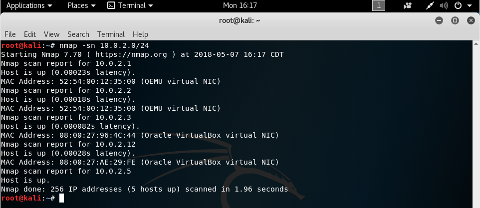

From these found IP addresses, we can narrow down our victim's IP address by seeing that only two addresses are identified as VirtualBox machines, and that knowing the address 10.0.2.3 is used by VirtualBox as its name server, meaning that our victim is at address 10.0.2.12.

## Scanning

Running the command `nmap -sV 10.0.2.12 -p-` will tell us the services running and their versions on all ports on the victim.

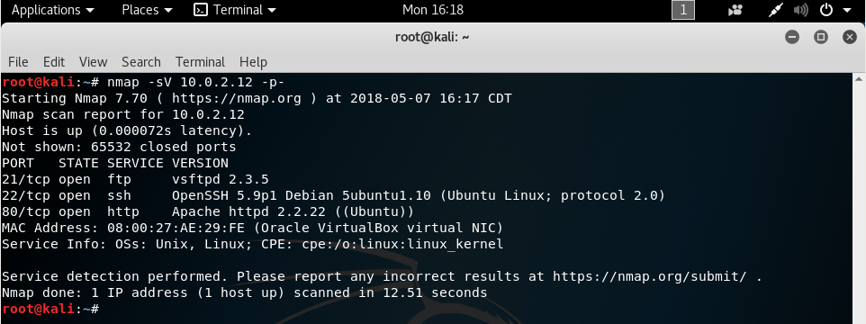

As we can see that there is an http service running on port 80, we can get more information about it with the `nikto` utility. Running `nikto -h 10.0.2.12` will pull information about the web service, and we can see that there is a URI that we can check out: /backup_wordpress/.

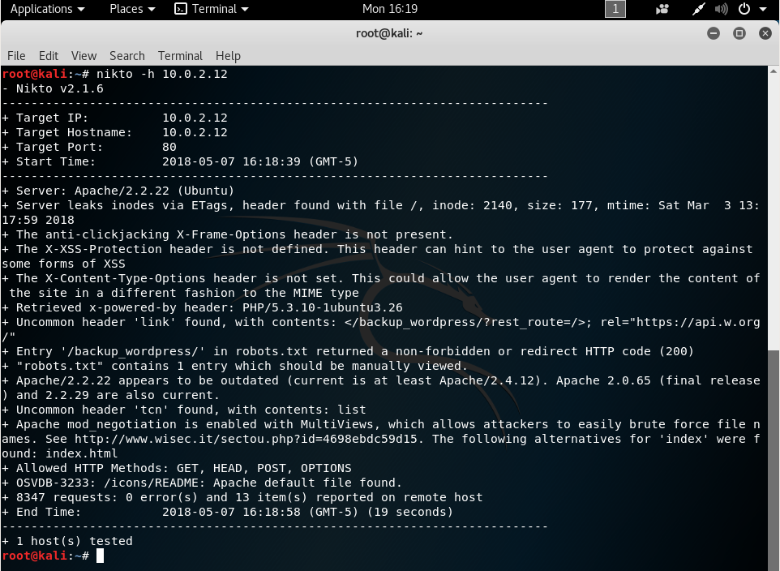

## Gaining Access

We can access the http service with our web browser by going to the URL `http://10.0.2.12/`. This leads us to a default web page with nothing of interest on it.

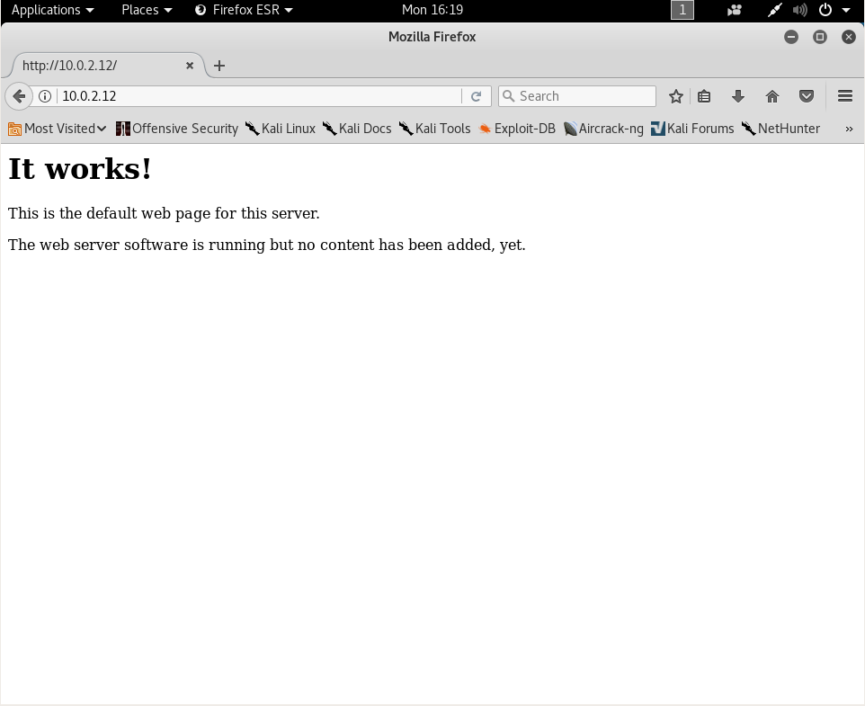

We can then browse to the path found by `nikto` by going to the URL `http://10.0.2.12/backup_wordpress/`. This leads us to a WordPress blog that appears to be deprecated.

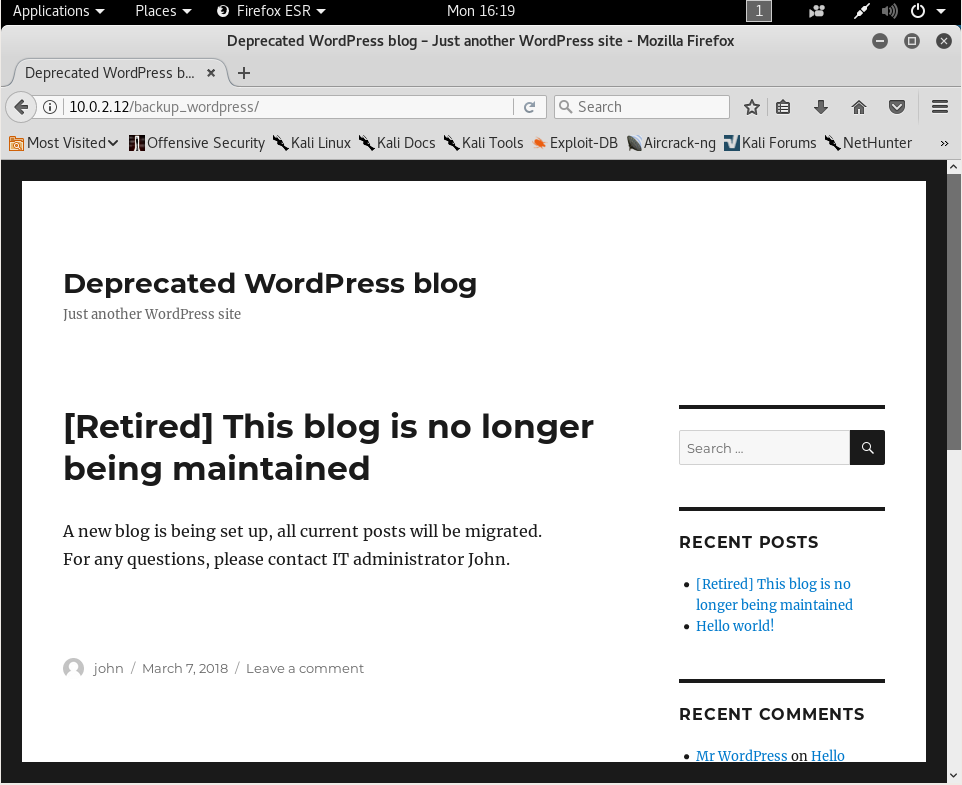

One of the links on the blog leads to a login page, signifying that we should try to find any users that we can log in as.

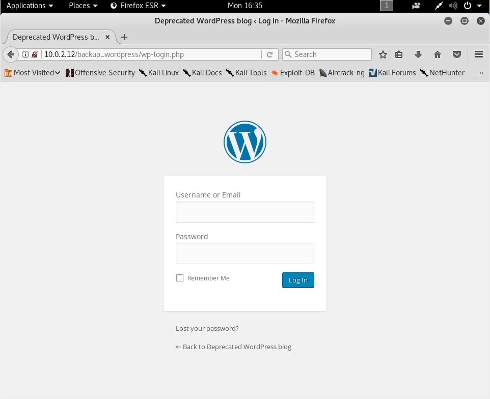

In our terminal, we can run the command `wpscan -u http://10.0.2.12/backup_wordpress/ --enumerate u --enumerate ap` to get information about the WordPress version and any vulnerabilities it has, the plugins running and any associated vulnerabilities, and the usernames on the blog.

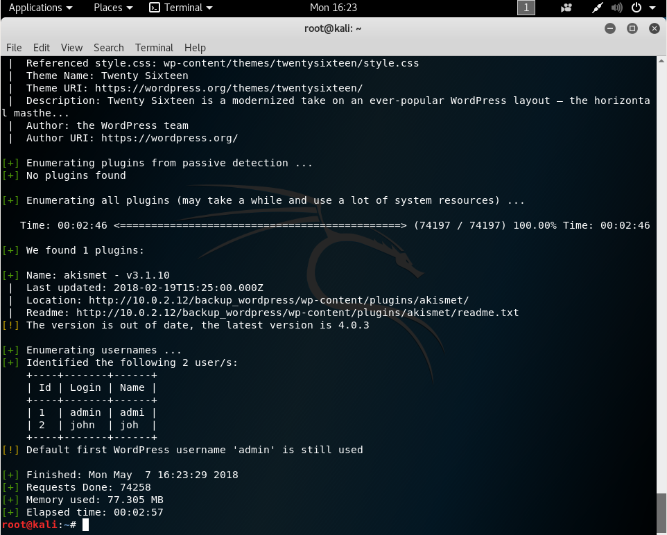

Through this scan, we've found two usernames that we can try to find a password for. We start up Burp Suite and capture a login request so that we can tell what parameters are being sent to the server. This will allow us to repeat those requests with a changed password.

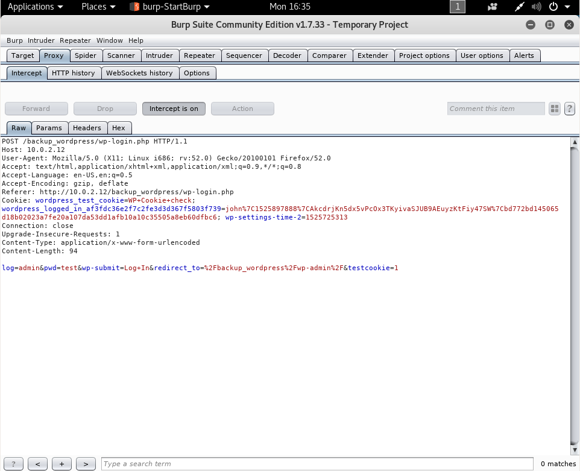

Now that we can see what a valid login request looks like, we can use the cURL utility to repeat these requests while changing the password until we find a valid one. I wrote a quick bash script to iterate over passwords in a wordlist to do this, but I later found out that the same functionality can be performed with `wpscan` with the command `wpscan -u http://10.0.2.12/backup_wordpress/ -w /usr/share/wordlists/top-10000.txt --username john`. My implementation of the dictionary attack can be found [here](brute.sh "My dictionary attack script").

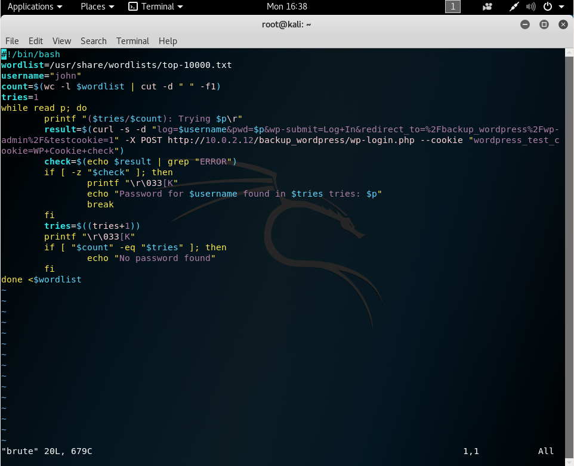

My script did not find a password for the admin user, but for the john user, it found a valid password of "enigma".

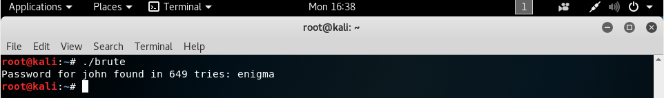

With this username and password combination, we can log in to the administrative interface.

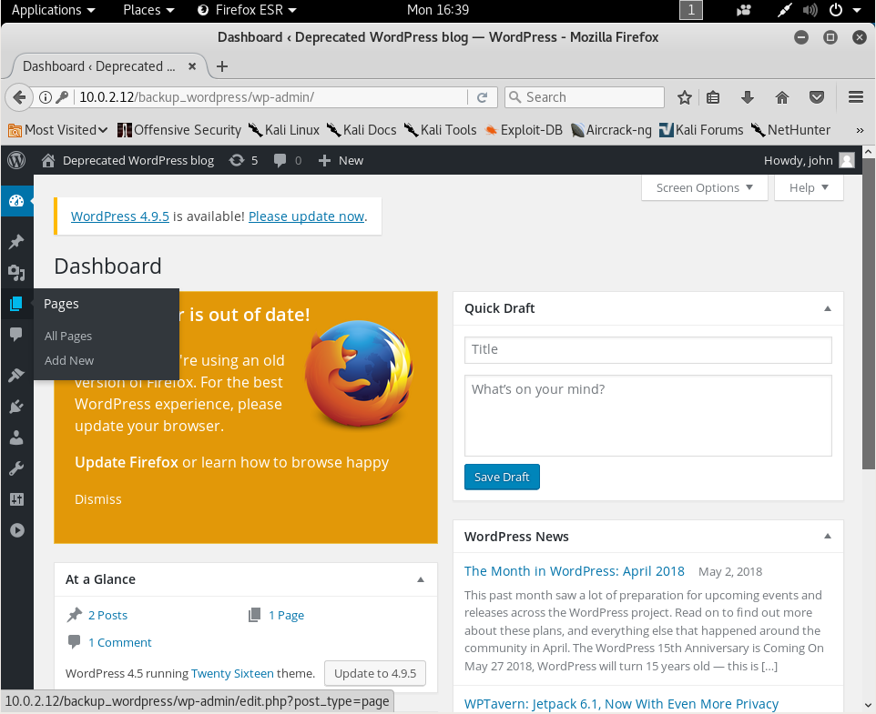

Now that we have admin access to the WordPress blog, we need to leverage that to get a shell to connect to the target machine itself. Fortunately, there's a [Metasploit module](https://www.rapid7.com/db/modules/exploit/unix/webapp/wp_admin_shell_upload "Metasploit module for getting a shell") that we can use for this task. Starting up Metasploit with `msfconsole` and then picking the module with `use exploit/unix/webapp/wp_admin_shell_upload`. Then, we can set the necessary options, such as the PASSWORD, RHOST, TARGETURI, and USERNAME options.

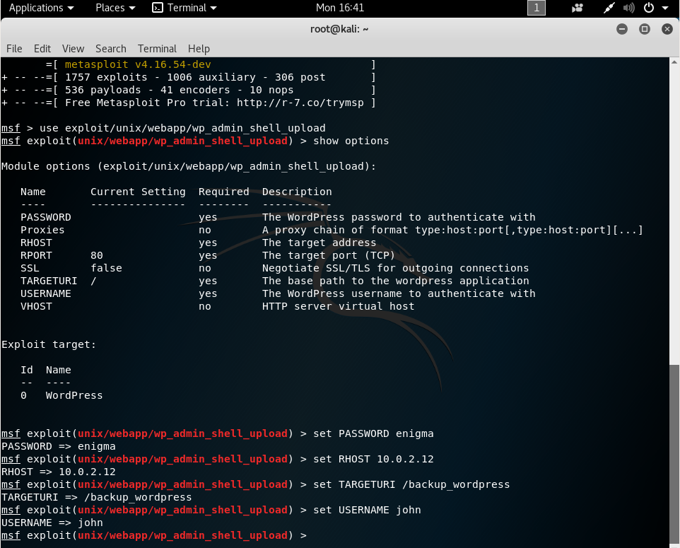

Once all these options are set, we can launch the module with `exploit`. This will generate a PHP plugin that will connect back to our attacking machine and start a meterpreter session. Once the meterpreter session has started, we can get a shell on the target machine with the `shell` command. Then, we can make our shell a little easier to use with the command `python -c 'import pty; pty.spawn("/bin/bash")'`

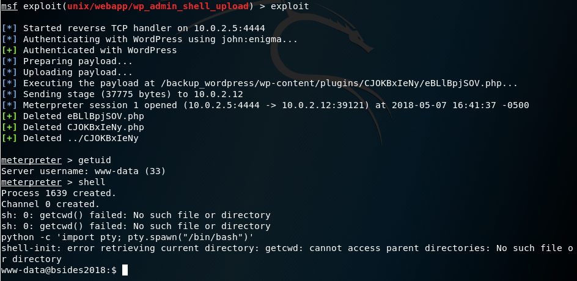

## Elevating Access

Now that we have a shell as the www-data user, we want to elevate our privileges so that we get root access to the machine. After doing some information gathering, I found a cron job that was running as the root user with a script that had global write permissions, /usr/local/bin/cleanup, meaning that we could write whatever we wanted into the cron job and it would be executed as root.

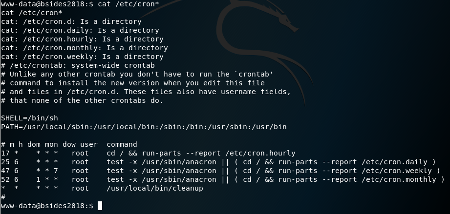

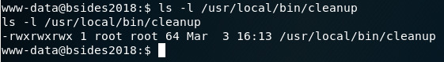

Running the command `echo "cp /bin/dash /tmp/pwn; chmod u+s /tmp/pwn; chmod root:root /tmp/pwn" >> /usr/local/bin/cleanup` will append a command to the script, which when run, will generate a file, /tmp/pwn, that will run the dash shell as a setuid file, meaning that we will get a shell running as root.

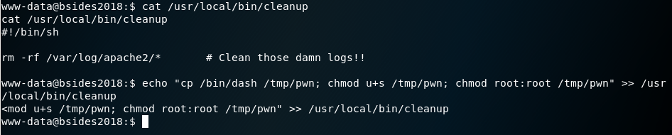

Running the file with `/tmp/pwn` will generate a dash shell, and we are now effectively root!

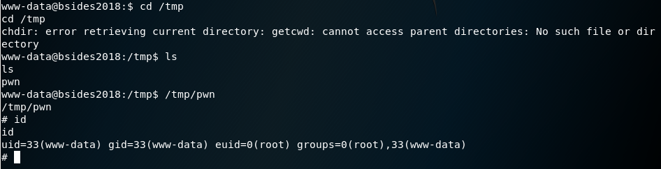

We can now read the flag with the command `cat /root/flag.txt`, and we have beaten this challenge.

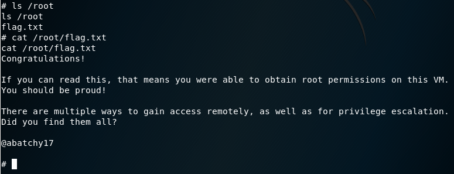
