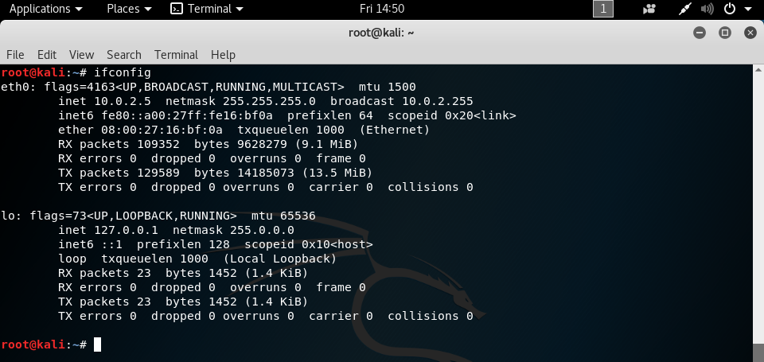
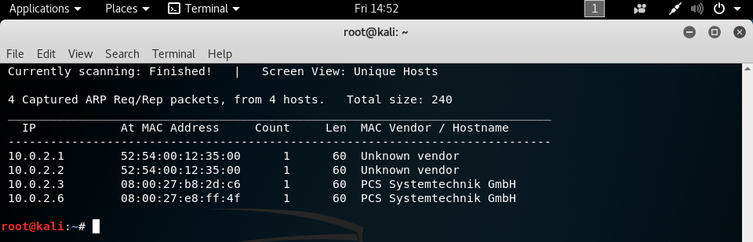
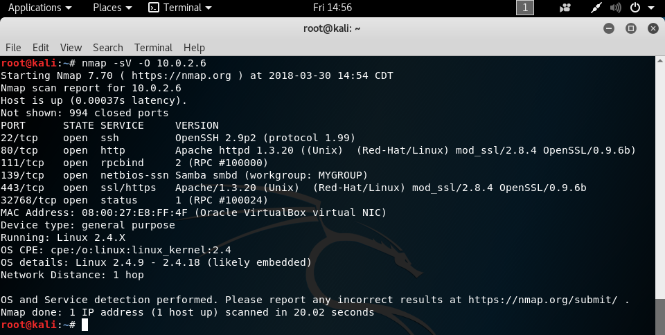
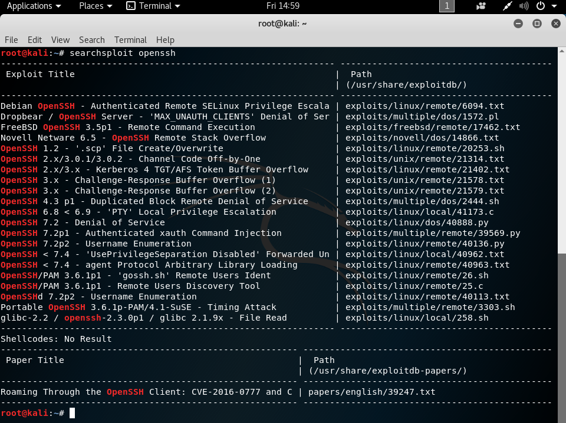
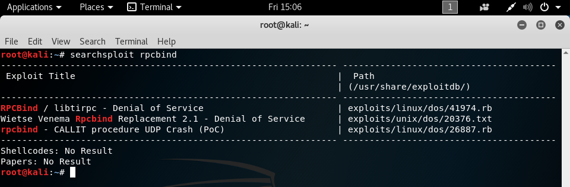
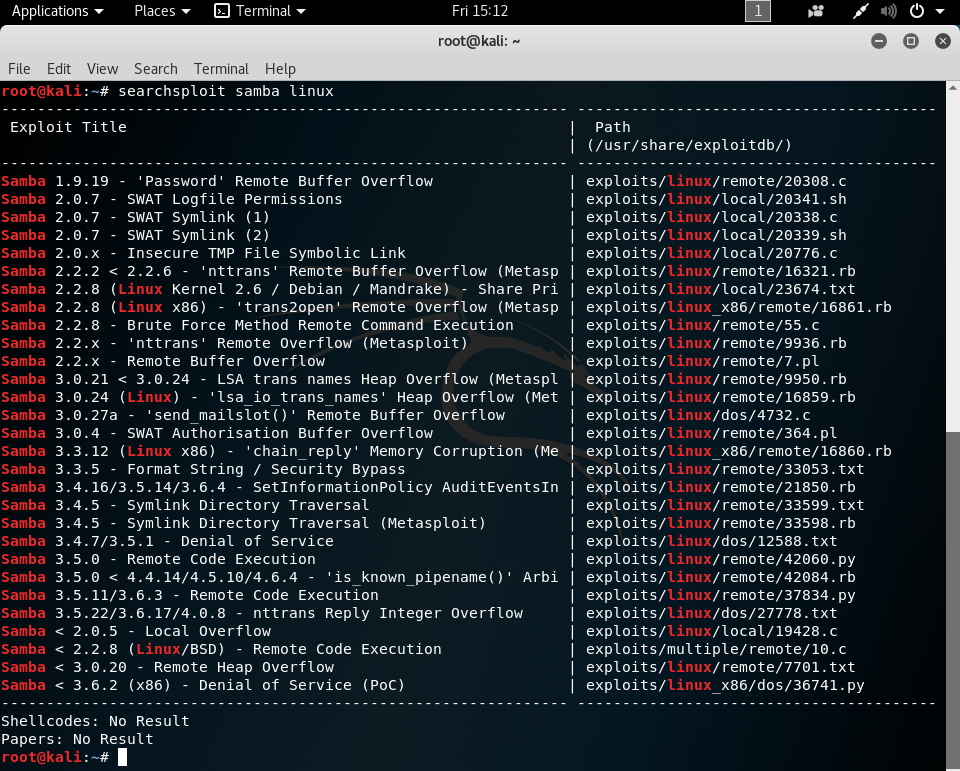
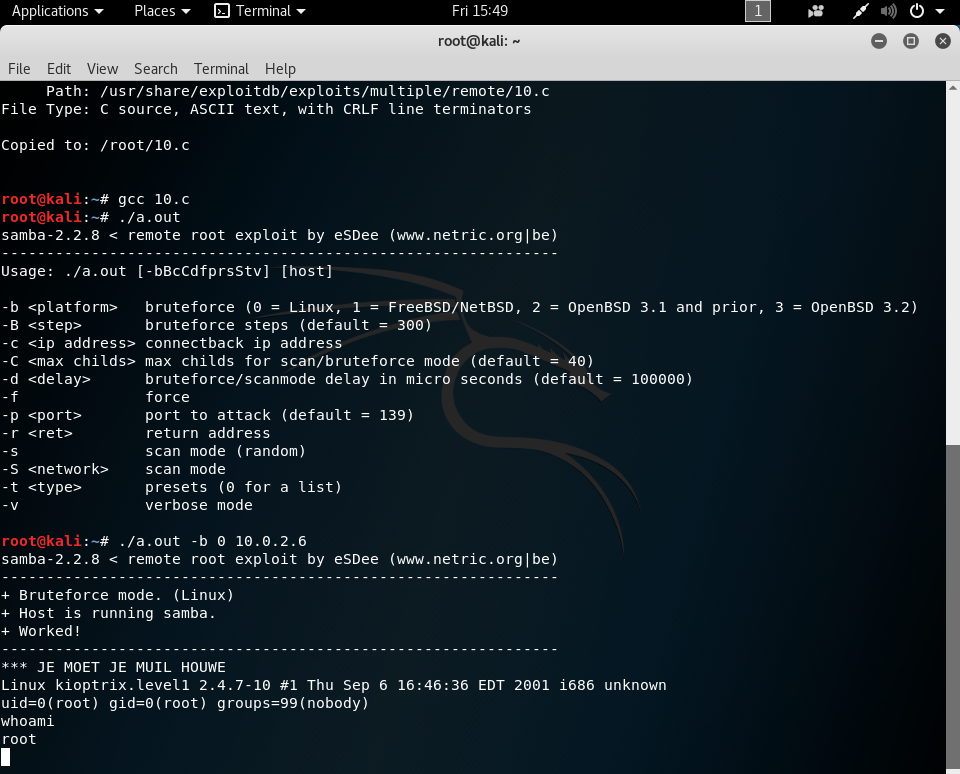

# Kioptrix 1.0 Writeup

This vulnerable virtual machine was obtained from [VulnHub](https://www.vulnhub.com/entry/kioptrix-level-1-1,22/ "URL for kioptrix 1.0"). The kioptrix series are intended for use with VMWare, but by following the instructions found [here](http://hypn.za.net/blog/2017/07/15/running-kioptrix-level-1-and-others-in-virtualbox/ "running kioptrix in VirtualBox"), you can get the virtual machines to work with VirtualBox.

## Information gathering

After booting up the attacker and vulnerable virtual machines, we can use the `ifconfig` and `netdiscover` commands to find the IP address of both of them. Running `ifconfig` will get us the IP address of the attacker machine, and from that, we can scan the local subnet with `netdiscover -i eth0 -r 10.0.2.0/24` to find the IP address of the vulnerable machine. We scan the local subnet because we know that VirtualBox assigns IPs in that subnet, but the command can be changed to be `/12` or something else depending on the range you wish to scan. The arguments to the `netdiscover` command specify that the network device `eth0` should be used for sniffing for ARP packets, and that the range to scan should be the IP addresses included in the `10.0.2.0/24` subnet, which are `10.0.2.1 - 10.0.2.254`.

`netdiscover` presents us with four possible IP addresses for our target machine, and now we must narrow down the specific one that we will be exploiting. Since we know that our target is running as virtual machine on VirtualBox, that narrows the options down to `10.0.2.3` and `10.0.2.6`, because VirtualBox typically uses the `08:00:27` MAC address prefix. Furthermore, VirtualBox uses `10.0.2.3` as the name server, so we know that the target is at `10.0.2.6`.

## Scanning

Now that we know what our target is, we will enumerate the ports that are open to try to see if any of them have vulnerable services running. The tool we'll use for that is `nmap`. Running `nmap -sV -O 10.0.2.6` will tell us the specific versions of the services running on the TCP ports, if possible, and also the operating system it's running, as compared to a normal `nmap 10.0.2.6`, which will just tell us the services that are running.

We can see that the target has several ports open, and we'll run down the list to try to see which ones we can exploit. We also see that it's running Linux, which may come in handy later.

## Gaining Access

Using the `searchsploit` command, we can look for exploits that the target could be vulnerable to. Running `searchsploit openssh` shows us all of the exploits available for OpenSSH from [exploit-db](https://www.exploit-db.com/ "exploit-db"), but unfortunately, none of them are of interest to us. We're looking for something that can give us remote code execution, and the only one found that does that is for FreeBSD, while our target is on Linux.

Because we didn't have any luck with port 22, we'll move on to considering the next one on the list, port 80. Since http is running on this port, we can try to navigate to the IP address in a web browser and see what we can find. Loading up `http://10.0.2.6` in Firefox gives us an Apache Web server test page, so we're not likely to find an attack vector here.

Moving on to the next port, we've got rpcbing running on port 111. Once again, we will run `searchsploit` to see if there are any useful exploits for us. The command `searchsploit rpcbind` will search for exploits available for rpcbind, and unfortunately, all of the ones found produce denials of service. While that might be useful to some, we're trying to get into the machine, so we'll have to keep looking.

Now we move on to the next port and service, Samba smbd running on port 139. Running `searchsploit samba linux` will search for Samba exploits specifically for Linux, as there are a lot of Samba exploits, so it's handy to narrow things down.

Because we're looking for remote command execution, three of these exploits stand out to us. These are exploits/linux/remote/55.c, exploits/linux/remote/42060.py, and exploits/linux/remote/10.c. Going in order, we'll copy them to the directory we're currently in and try them out to see if they provide what we want. Starting off, we'll copy 55.c with the command `searchsploit -m 55`, which will generate a copy of the source code for us. Compiling it with `gcc 55.c` gives a lot of errors, so we'll skip this exploit.

Next, we'll copy over 42060.py with `searchsploit -m 42060`. Trying to run it with `python 42060.py` gives an error of `ImportError: No module named smb.SMBConnection`. We can fix this by installing the required module with `pip install pysmb`, but trying to run the program gives more errors, so we'll move on to the next exploit.

Finally, we'll copy over 10.c with `searchsploit -m 10`. As this is another C file, we'll compile it with `gcc 10.c`. Running the exploit with `./a.out` will show us the arguments that we need to use. If we run `./a.out -b 0 10.0.2.6`, the exploit will exploit a buffer overflow with a brute force attack tailored specifically for Samba on Linux, and after a few seconds, the exploit finishes running and we have a root shell on the target!

