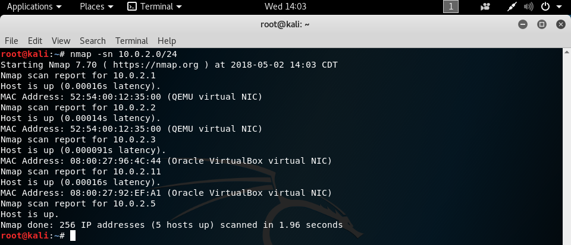
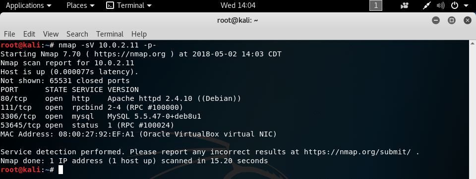
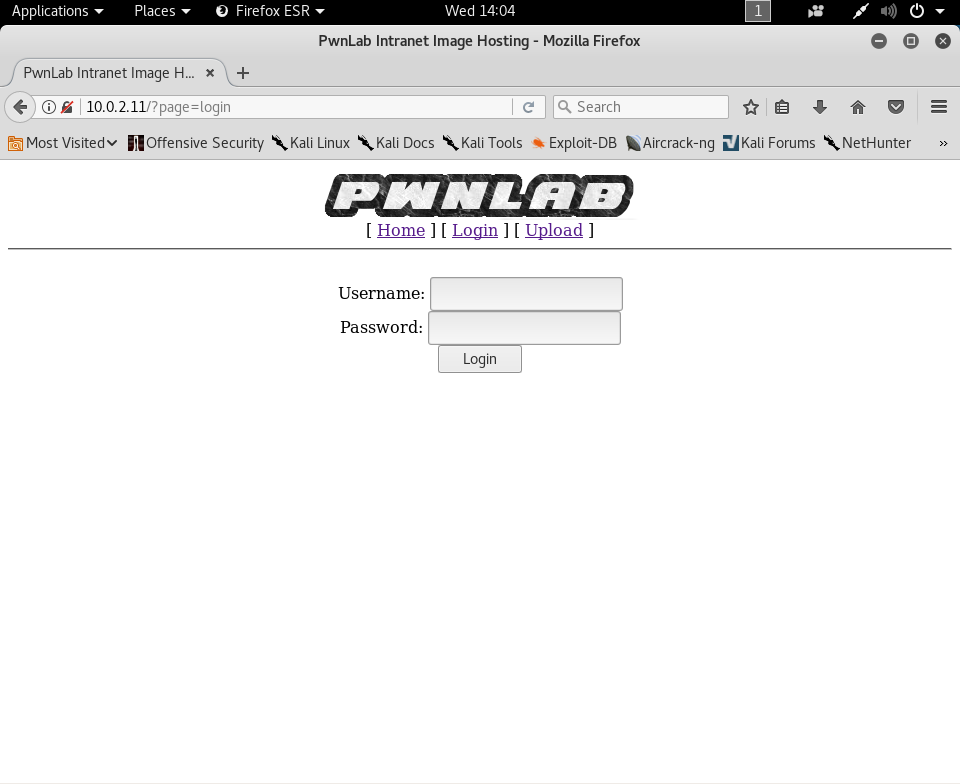
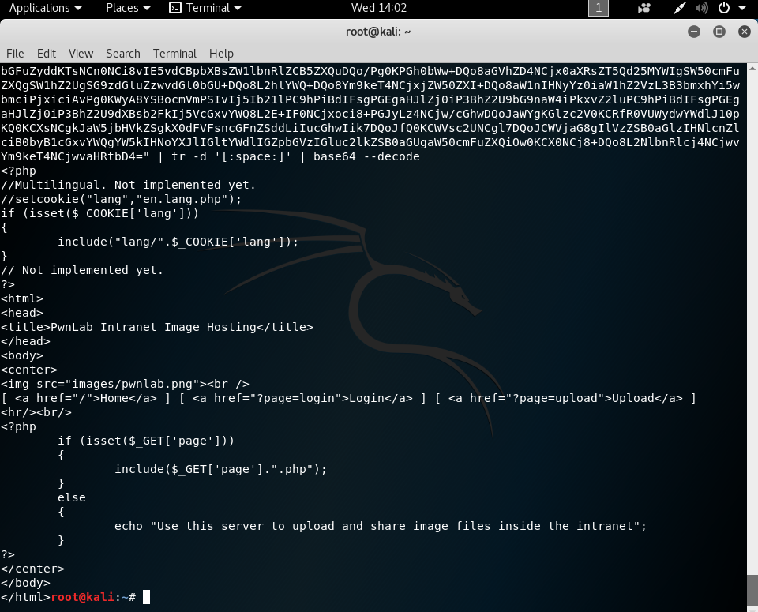
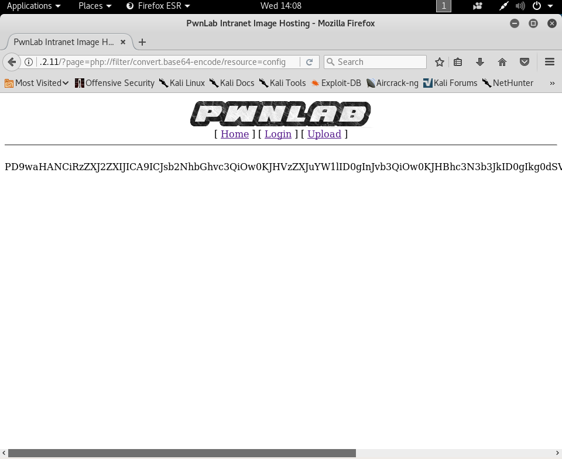
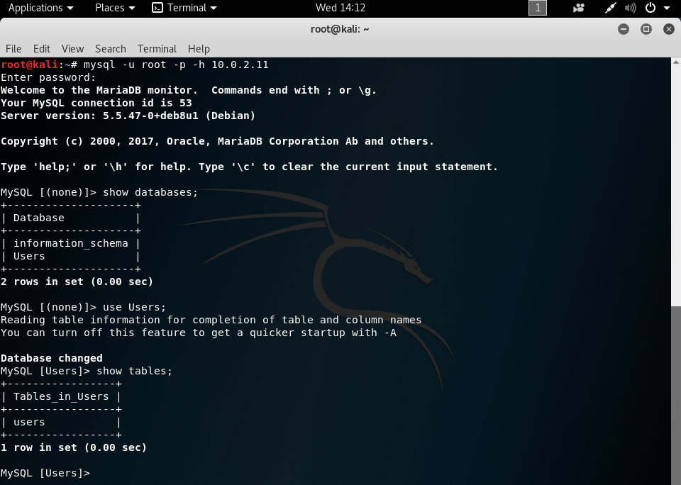
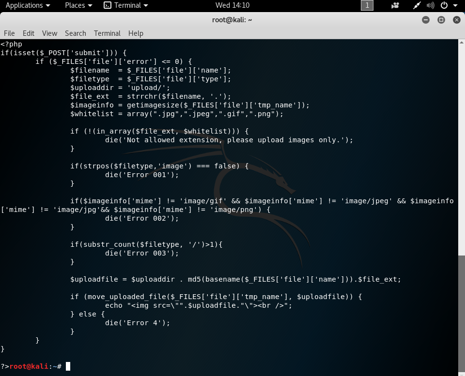
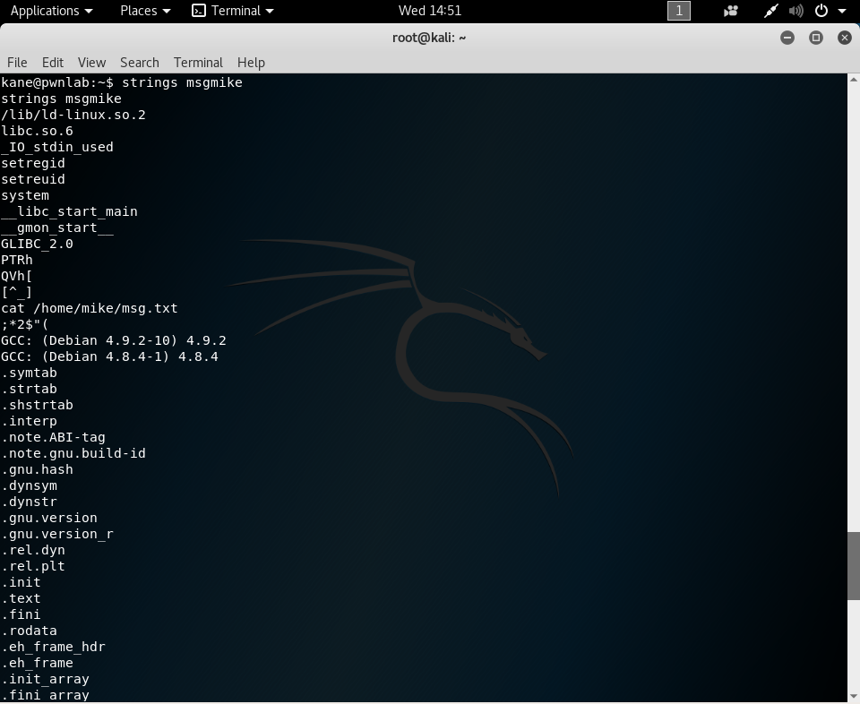
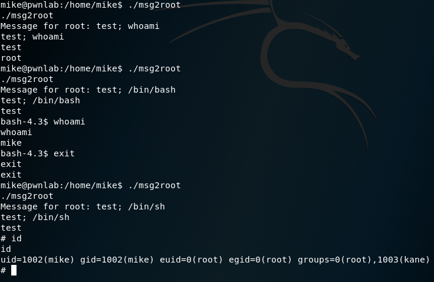

# PwnLab: init writeup

This vulnerable virtual machine was obtained from [VulnHub](https://www.vulnhub.com/entry/pwnlab-init,158/ "URL for PwnLab: init").

## Information Gathering

Using the `ifconfig` command, we have determined that our attacking machine's IP address is 10.0.2.5. We can then use the command `nmap -sn 10.0.2.0/24` to scan the local subnet to find what the victim's IP address is.

From these found IP addresses, we can narrow down our victim's IP address by seeing that only two addresses are identified as VirtualBox machines, and that knowing the address 10.0.2.3 is used by VirtualBox as its name server, meaning that our victim is at address 10.0.2.11.

## Scanning

Running the command `nmap -sV 10.0.2.11 -p-` will run tell us the services and their versions on all ports on the victim.

Because we see that the target has an http service running on port 80, we can also run the command `nikto -h 10.0.2.11` which will give us more information about the web application running.

We can see that `nikto` found possible database IDs and passwords at /config.php, so that will be worth checking out.

## Gaining access

Because the http service is running on port 80, we can simply go to `http://10.0.2.11` in a web browser to be directed to the front page of the website.

We can see that there are two additional links, Login and Upload at the top of the site. The upload link directs us to a page that says we need to be logged in, and the login link directs us to a login screen.

I tried using common SQL injections on the login page, manually and through `sqlmap`, but unfortunately, this was not an attack vector. However, I noticed that the URL of the login page includes a parameter "?page=login", which could mean that the site has a local file inclusion vulnerability.

After some [research](https://highon.coffee/blog/lfi-cheat-sheet/ "Local file inclusion cheat sheet"), I found that we can use the php://filter wrapper to display a file encoded with base64. If we put `http://10.0.2.11/?page=php://filter/convert.base64-encode/resource=index` in the URL, we get the contents of index.php encoded in base64.

We can then echo the contents and pipe them through `tr -d '[:space:]'` to remove the leading newline and then pipe the result through `base64 --decode` to decode the contents of index.php.

Now that we know we can obtain the contents of files, we can get the contents of /config.php, which `nikto` said could contain database IDs and passwords. The URL we'll use for this is `http://10.0.2.11/?page=php://filter/convert.base64-encode/resource=config`

And, now that we have the base64-encoded contents, we can echo them and pipe them through `base64 --decode` to get the decoded contents.

The config.php file includes a username and password for a database, and because we saw that MySQL was running on port 3306 in the `nmap` scan, we can connect to the database with the command `mysql -u root -p -h 10.0.2.11` and entering the password when prompted.

Through the `show databases;` command, we see that there are two databases, and we will work in the Users one with the command `use Users;`. To list the tables in the database, we use `show tables;`, which tells us that there is a single table called users. The command `select * from users` will list the contents of this table, and it appears to be usernames and base64-encoded passwords.

We can take the encoded passwords and echo them, piping the result through `base64 --decode` to get the plaintext passwords.

Now that we have usernames and passwords, we unfortunately can't connect directly to the victim because the SSH service isn't running, but we can use the information in the login screen of the website. I used the first user, kent, for this.

Logging in directs us to the upload page where we can select a local file and upload it to the web server. I decided to look at the code for the upload page to see if there were any restrictions in place.

Using `http://10.0.2.11/?page=php://filter/convert.base64-encode/resource=upload` as the URL will give us the contents of upload.php encoded in base64, and we can decode them by echoing them and piping them through `tr -d '[:space:]'` and then through `base64 --decode`

The upload page will only accept files with an extension of .jpg, .jpeg, .gif, or .png, and uses the getimagesize() function to check if the uploaded file actually is an image file. However, the getimagesize() function only checks file signatures, so if we were to have a reverse shell, we could simply add a valid [file signature](https://en.wikipedia.org/wiki/List_of_file_signatures "List of file signatures") to the beginning and it would pass the check.

I saved my reverse shell as shell.php.gif and prepended it with `GIF89a` so that it passes as a .gif file, and the results of the `file` command show that it should get through the file check.

Starting a listener on our attacking machine with `nc -lvp 4444` will provide a connection for us to the victim once the reverse shell is executed.

After uploading the file, the website attempts to display the GIF, but because it's not an actual image, it fails to do so. In addition, our reverse shell hasn't phoned home yet. 

Looking back at the index.php contents, I noticed that there was an interesting line at the top. If the "lang" cookie was set when index.php was accessed, then the site would include and evaluate the file specified at lang/\<cookie value\>. Because the cookie value can be controlled by us, we can get our shell to run if we include its location in the cookie value. We can see where our reverse shell was saved on the web server by going to the URL `http://10.0.2.11/upload/`, which will give us the filename of the shell, which is just the MD5 hash of the original filename.

So from the lang directory, our shell can be found at ../upload/b1a99ebaad4dd28f57517de36e770484.gif, and this will be our cookie content. Using Burp Suite, I captured a request to `http://10.0.2.11`, and we can modify this request to contain our cookie. A guide to setting up Burp Suite can be found [here](https://portswigger.net/burp/help/suite_gettingstarted "Burp Suite setup guide").

We can then right-click on this request and send it to the repeater, and if we check its params, we can add our cookie through the "Add" button. After adding the lang cookie and its content, we can click the "Go" button to issue the request, which will evaluate our reverse shell and connect back to our listener, giving us access to the victim.

## Escalating Privileges

Now that we have access, we will try to escalate to root access. Given that we have usernames and passwords for the database, I decided to check to see if the users on the system had the same passwords. We can do so by using the command `su <username>` and entering the password when prompted. I needed to run the command `python -c 'import pty; pty.spawn("/bin/bash")'` to get a proper shell environment first. The kent user did reuse the password, but their home directory was empty and they were unable to sudo, so I skipped them.

The mike user did not have the same password, so we can't use them. The kane user did reuse the password, and their home directory had an interesting file in it, msgmike.

The results of the `file msgmike` command shows that it is a setuid, setguid executable, and running `strings msgmike` shows that it runs the command `cat /home/mike/msg.txt`.

Notably, the `cat` command doesn't use the full path of `/bin/cat`, so if we add our own `cat` program and modify the path so that our version is seen first, we will be able to run an arbitrary command as the mike user. If we run `echo "/bin/bash" > cat` and then `chmod +x cat`, it will create an executable file that will run `/bin/bash` when called. Then, we change the path by the command `export PATH=.:$PATH`, which will append the current directory to the front of the path variable, making it so that our version of `cat` will be executed before `/bin/cat` can be. Running the msgmike file with `./msgmike` will then give us a shell as the mike user.

The mike user's home directory also contains an interesting file, msg2root. When run, the command takes in an input, and from using `strings msg2root`, it echoes the input to /root/messages.txt. This file is also a setuid, setgid file and in this case, it runs with the permissions of the root user.

However, this implementation is vulnerable to command injection. If we use a semicolon and a valid command as input, such as `; whoami`, the command will then be executed as the root user. This means that if the input is `; /bin/sh`, then running the command will give us a shell as root. Interestingly, this only works with /bin/sh and not /bin/bash.

We can then read the flag with `cat /root/messages.txt`, and we've beaten this virtual machine!

